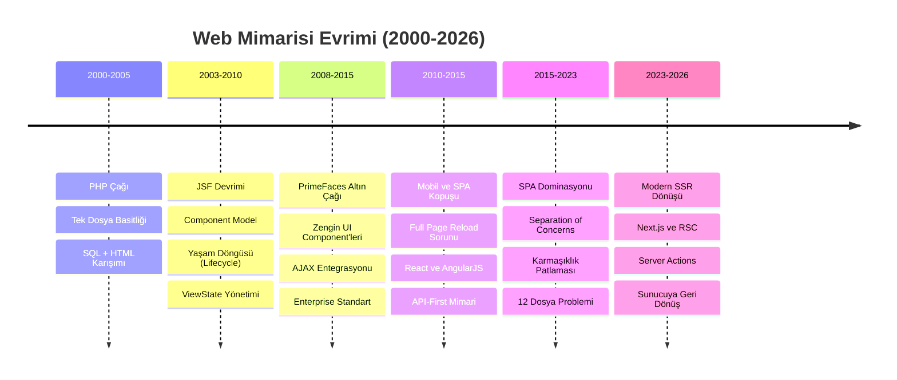
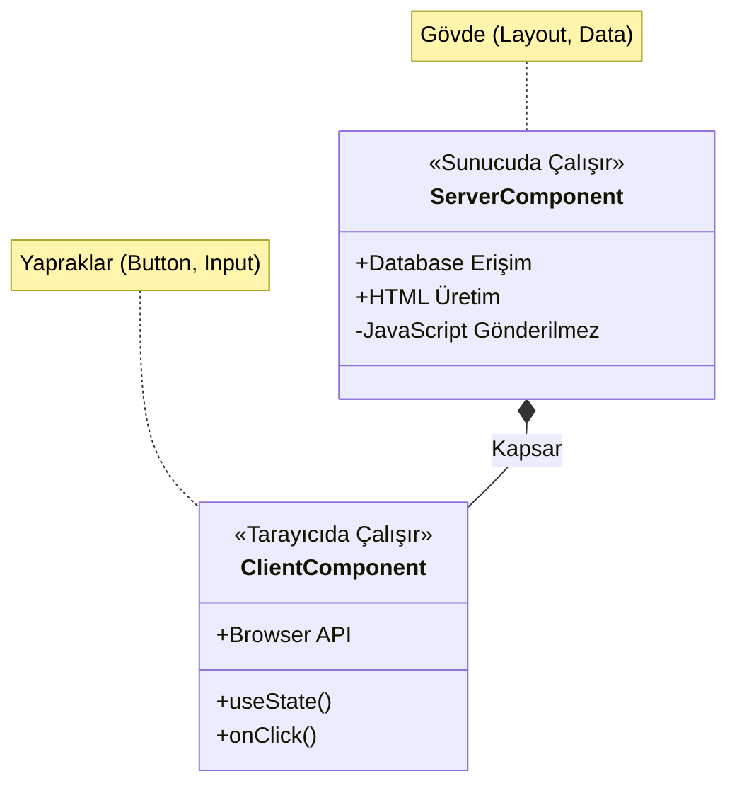
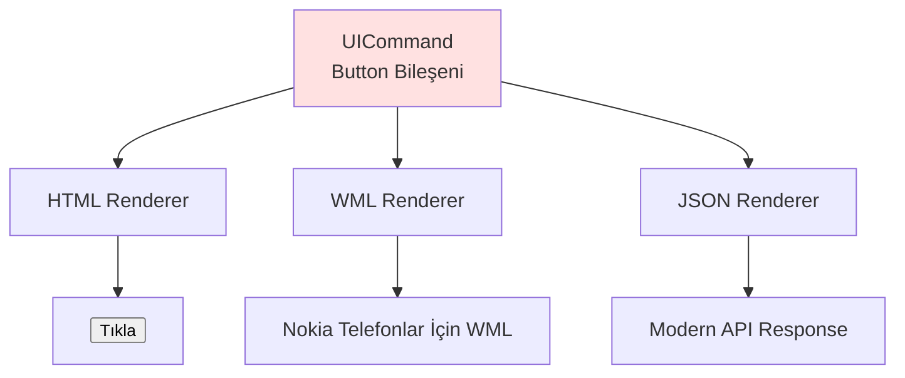
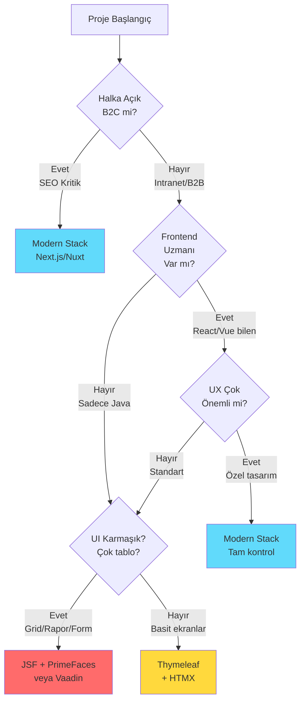

# JSF'ten Modern Mimariye: Tarihsel Döngü ve Pratik Dönüşüm Rehberi

**Ana Tema:** "Tarih Tekerrürden İbarettir: Sunucudan Ayrılış ve Eve Dönüş"

Bu doküman, 2000'lerin başındaki JSF (JavaServer Faces) mimarisi ile 2026'nın Modern Web Mimarisi (Next.js, RSC) arasındaki şaşırtıcı benzerlikleri, nedenlerini ve bu dönüşümün nasıl yönetileceğini anlatır. Amacımız bir teknolojiyi diğerine üstün kılmak değil, **mimari sarkacın** hareketini anlayarak geleceği öngörmektir.

---

## 🎯 Giriş: Bu Belgenin Amacı

Bu doküman bir teknoloji karşılaştırması **değildir**. Bu, web geliştirme mimarisinin 25 yıllık evriminin hikayesidir. **İki temel amacımız var:**

1. **Mimari Sarkacın Hareketini Anlamak**: Her teknolojinin **neden** ortaya çıktığını, **hangi problemi** çözdüğünü ve **hangi yeni problemleri** yarattığını keşfetmek.

2. **Gizli Abstraction'ları Görünür Kılmak**: Modern software stack'lerin katmanları arasına gizlenmiş component'leri, mekanizmaları ve tasarım kararlarını açığa çıkarmak. Birçok developer, kullandığı framework'ün "magic" diye gördüğü özelliklerin aslında 20 yıl önceki çözümlerin modern versiyonları olduğunu bilmez.

### Sizin Yolculuğunuz

Bu dokümanı bir **teknik yolculuk** olarak tasarladık. Her bölümde:
- 🔍 **Görünmeyen mekanizmaları** göstereceğiz (ViewState, Closure, Lifecycle)
- 🎭 **Abstraction perdelerini** aralayacağız (Server Actions = RPC, RSC = Server-Side Rendering)
- 🏗️ **Mimari tradeoff'ları** açıklayacağız (RAM vs Bandwidth, Security vs Flexibility)

### Kritik Kavramlar (Önden Bilmeniz Gerekenler)

#### 1. Veriye Yakınlık (Data Proximity)
> **Mantığı Client'ta kurduğunuzda**, veritabanına ulaşmak için ağ üzerinden (**Network Waterfall**) defalarca gidip gelmeniz gerekir.  
> **Mantığı Sunucu'ya taşıdığınızda**, veritabanı hemen yanınızdadır (**~0 latency**).

Bu, mimarideki en temel tradeoff'lardan biridir ve bu doküman boyunca tekrar tekrar göreceğiz.

#### 2. Güvenlik ve Gizlilik
> Hassas iş mantığını ve API anahtarlarını kullanıcının tarayıcısına göndermek yerine **sunucuda tutmak** her zaman daha güvenlidir.

SPA (Client-side) mimarinin en büyük zaaflarından biri budur.

### Temel Felsefe: "Sarkaç"
> **"Mükemmel mimari yoktur, sadece bağlama uygun çözümler vardır."**

Her dönemde, geliştiriciler ellerindeki araçlarla en iyi çözümü bulmaya çalıştı. Bugün "eski" dediğimiz teknolojiler, kendi zamanlarında devrimciydi. Yarın "eski" diyeceğimiz teknolojiler, bugün modern kabul ediliyor.

#### Önemli Not: "Eskiye Dönmüyoruz, Spiral Çıkıyoruz"

Bu doküman boyunca JSF (2006) ile Next.js (2024) arasındaki benzerlikleri göreceksiniz. Bu varsayım **doğru** olsa da, **"Eskiye dönüyoruz"** demek yanlış olur. 

**Sarkaç geri dönüyor ama bir üst seviyeden dönüyor:**
- JSF: Sunucu odaklı, ama modern tooling yok, type safety zayıf
- Next.js: Sunucu odaklı **+** TypeScript end-to-end **+** Modern DX **+** Edge computing
(Burada jsf yada  herhangi bir server dili ile yazilmis bir programlama dili neden type safety zayıf bunu soru olarak sorabiliriz.) 

Bir sarkaçtan çok, **yukarı doğru bir spiral** hareketi bu. Her döngüde bir önceki çözümün öğrendiklerini alıp, yeni teknolojiyle harmanlıyoruz.


### Yol Haritamız



---

## 🎯 Üç Temel İlke: Değişmeyen Hakikatler

Bu yolculukta tekrar tekrar göreceğiniz üç evrensel hakikat var. Bunları baştan bilmek, teknolojiler arasındaki geçişleri anlamanızı kolaylaştıracak.

> [!NOTE]  
> **"Yeni teknolojiler, eski problemleri yeni söz dizimiyle (syntax) çözer. Problemler sabittir."**

  
*📷 Görsel üretilecek: Sihirbaz şapkasından tavşan çıkarmak (illüzyon) vs. Arka planda mekanik düzenek (gerçek)]*

### İlke 1: State Management Asla Kaybolmaz, Sadece Yer Değiştirir

**Durum yönetimi** web'in temel problemidir. HTTP protokolü "stateless" (durumsuz) olduğu için, kullanıcının durumunu bir yerde tutmalıyız:

- **JSF (2006)**: Sunucu RAM'inde (Session + ViewState)
- **React SPA (2015)**: Tarayıcı hafızasında (Redux, Context)
- **Next.js (2024)**: Hibrit (Sunucu + Client, closure ile)

**Değişen:** Nerede saklandığı  
**Değişmeyen:** Saklanması gerektiği

#### State Saklama Yöntemlerinin Evrimi

Sunucunun kullanıcıyı "hatırlaması" için kullanılan yöntemler de evrim geçirdi:

| Dönem | Yöntem | Teknoloji | Artısı | Eksisi |
|-------|--------|-----------|--------|---------|
| **1990'lar** | Dosya (Disk) | Text Files | Basit | Çok yavaş, kilitlenme |
| **2000'ler** | RAM (In-Memory) | Servlet Session | Çok hızlı | Sunucu kapanırsa uçar |
| **2005-2015** | **Veritabanı** | SQL Session Table  | **Kalıcı, Web Farm** | **DB'yi yorar** |
| **2010+** | Cache Sunucusu | **Redis, Memcached** | Hızlı + Paylaşılır | Ekstra altyapı |
| **2015+** | Client-Side | JWT Token | Sunucu masrafsız | Logout yönetimi zor |

> [!NOTE]  
> **Bankacılık ve yüksek güvenlikli sistemler** bugün bile Redis ile birlikte veritabanını kullanır. "Kesinlikle kaybolmaması gereken" session verileri için performans kaybı göze alınır.

**Günümüzde (2024)**: Çoğu sistem **Redis** (hızlı cache) + **JWT** (stateless API) kombini kullanıyor.

### İlke 2: Abstraction Arttıkça Kontrol Azalır

**Abstraction** (soyutlama), kodun üstünü örtmektir. Ne kadar çok örtersen, o kadar az görürsün ve kontrol edersen.

- **Düşük Abstraction** (PHP): Her şeyi görürsün, her şeyi manuel yaparsın
- **Orta Abstraction** (JSF): Lifecycle gizli, ama yönetilebilir
- **Yüksek Abstraction** (Modern frameworks): "Magic" gibi çalışır, ama hata ayıklama zor

**Tradeoff:** Rahatlık vs Kontrol

### İlke 3: Complexity Yok Edilemez, Sadece Transfer Edilir

Fizikteki "Enerjinin Korunumu Yasası" gibi, yazılımda da "**Karmaşıklığın Korunumu**" vardır.

  
*📷 Görsel üretilecek: Karmaşıklık topu el değiştiriyor (Server → Network → Client → Build Tools)*

- **JSF**: Karmaşıklık sunucuda (Lifecycle, Session)
- **SPA**: Karmaşıklık istemcide (State sync, Tooling)  
- **Modern Stack**: Karmaşıklık dağıtıldı (Sunucu + İstemci + Build Time)

**Sonuç:** Karmaşıklığı yok edemezsiniz, sadece en az zarar vereceği yere taşırsınız.

---

## 1️⃣ Başlangıç: PHP Çağı (2000-2005)

### Bağlam: 2000'lerin Web'i
- İnternet hızları: 56k modem, ADSL yeni yeni
- E-ticaret patlaması (Amazon, eBay)
- Web uygulamaları çoğunlukla basit CRUD
- Güvenlik henüz birincil öncelik değil

### PHP'nin "Tek Dosya" Felsefesi

PHP, web geliştirmeyi demokratikleştirdi. Herhangi biri bir `.php` dosyası oluşturup FTP ile sunucuya atabilirdi.

**Örnek: Kullanıcı Listesi (users.php)**

```php
<?php
// Veritabanı bağlantısı
$conn = mysql_connect("localhost", "root", "password");
mysql_select_db("myapp", $conn);

// Veri çekme
$result = mysql_query("SELECT * FROM users");
?>

<!DOCTYPE html>
<html>
<head><title>Kullanıcılar</title></head>
<body>
    <h1>Kullanıcı Listesi</h1>
    <table border="1">
        <tr><th>ID</th><th>İsim</th><th>Email</th></tr>
        <?php while($row = mysql_fetch_assoc($result)): ?>
        <tr>
            <td><?= $row['id'] ?></td>
            <td><?= $row['name'] ?></td>
            <td><?= $row['email'] ?></td>
        </tr>
        <?php endwhile; ?>
    </table>
</body>
</html>
```

### ✅ PHP'nin Güçlü Yönleri

1. **Locality of Behavior**: Her şey bir yerde, anlaşılır
2. **Hızlı Geliştirme**: Fikir → Kod → Canlı: 10 dakika
3. **Düşük Öğrenme Eğrisi**: HTML biliyorsanız, PHP öğrenebilirsiniz
4. **Deployment Basitliği**: FTP yeterli

### ❌ PHP'nin Sınırları

1. **Güvenlik Açıkları**: SQL Injection (yukarıdaki kod savunmasız!)
2. **Bakım Sorunu**: 5000 satırlık `index.php` dosyaları
3. **Separation of Concerns Yok**: SQL, Business Logic, HTML hepsi bir arada
4. **Ölçekleme Zorluğu**: Session yönetimi, code reusability
5. **Tip Güvenliği Yok**: Runtime hatalar yaygın

### Neden Yeterli Değildi?

2005'e gelindiğinde, web uygulamaları karmaşıklaştı:
- Banka sistemleri
- Kurumsal ERP'ler
- Çok kullanıcılı sistemler
- Güvenlik kritik hale geldi

**Enterprise dünyası şunu sordu**: "PHP'nin basitliğini koruyabilir, ama Java'nın güvenliğini ve yapısını ekleyebilir miyiz?"

Cevap: **JSP ve JSF**

---

## 2. Büyük Resim: Mimari Sarkaç (The Pendulum)

Yazılım dünyası doğrusal bir çizgide ilerlemez; bir sarkaç gibi salınır. Biz şu an, sarkacın tekrar "Sunucu" (Server) tarafına döndüğü tarihi bir ana tanıklık ediyoruz.

```mermaid
graph LR
    A[2000-2010: Sunucu Odaklı] -- Sarkaç İstemciye Kaydı --> B[2010-2023: İstemci Odaklı]
    B -- Sarkaç Sunucuya Döndü --> C[2024+: Hibrit/Sunucu Odaklı]
    
    subgraph "Dönem 1: Monolitik Güç"
    A --> JSF[JSF / ASP.NET]
    A --> Logic1[Mantık Sunucuda]
    end
    
    subgraph "Dönem 2: Dağıtık Özgürlük"
    B --> SPA[React / Angular SPA]
    B --> Logic2[Mantık Tarayıcıda]
    end
    
    subgraph "Dönem 3: Modern Sentez"
    C --> Next[Next.js / RSC]
    C --> Logic3[Mantık Sunucuda (Tekrar)]
    end
```

### Aydınlanma Anı (The Aha! Moment)
*   **Dün (JSF):** `h:commandButton` ile sunucudaki bir Java metodunu çağırırdık.
*   **Bugün (Next.js):** `Server Actions` ile sunucudaki bir TypeScript fonksiyonunu çağırıyoruz.
*   **Fark:** Aradaki teknoloji (XML vs JSX, HTTP Session vs Closure) değişti, ama **zihniyet** (Mindset) aynı: "Veri nerede duruyorsa, işlem orada yapılmalıdır."

---

## 2. Component Ağacı: Evden Uzakta Bir Gezi

UI bileşenlerimiz (Button, Input, Panel) nerede yaşıyor? Bu sorunun cevabı, mimarinin kalbidir.

### A. JSF: "Ağaç Sunucuda Yaşar"
JSF'de `UIViewRoot` sunucu hafızasındadır (Heap). Tarayıcı sadece bir "yansıtıcıdır" (Renderer).
*   **Avantaj:** Güvenli, veritabanına yakın.
*   **Dezavantaj:** Sunucu belleği şişer (Session Replication derdi).

### B. React SPA: "Ağaç Tarayıcıya Taşındı"
2010'larda ağacı söküp kullanıcının tarayıcısına (Virtual DOM) taşıdık.
*   **Avantaj:** Sunucu rahatladı (Stateless), etkileşim hızlandı.
*   **Bedel:** Kullanıcının telefonu ısındı, "Loading..." spinner'ları hayatımıza girdi.

### C. Modern Mimari (RSC): "Ağaç Eve Dönüyor"
React Server Components (RSC) ile ağacın gövdesini tekrar sunucuya taşıdık, sadece yapraklarını (Interactivity) tarayıcıda bıraktık.



```

---

### 🔍 JSF'in Kalbi: Request Processing Lifecycle (Derinlemesine İnceleme)

> [!IMPORTANT]  
> **"Çoğu geliştirici JSF'i 'Sihirli bir kutu' olarak görür. Bir inputText koyarsınız, veritabanına gider. Arada ne olur? Bilinmez. Bugün o kutuyu açıyoruz. Göreceğimiz şey sihir değil; HTTP protokolünü Java nesnelerine, Java nesnelerini HTML'e çeviren devasa bir 'Çeviri Motoru'dur."**

#### 6 Fazlı Döngü: Her İstekte Aynı Hikaye

Bir JSF sayfasına tıkladığınızda, sunucu tarafında bu **6 adım asla şaşmaz**. Modern frontend framework'lerinde `useEffect` karmaşası yaşarken, JSF 20 yıldır bu katı disiplini uygular.

```mermaid
graph TD
    A[1. Restore View<br/>Görünümü Geri Yükle] --> B[2. Apply Request Values<br/>İstek Değerlerini Al]
    B --> C[3. Process Validations<br/>Doğrula]
    C --> D[4. Update Model Values<br/>Modeli Güncelle]
    D --> E[5. Invoke Application<br/>Uygulamayı Çalıştır]
    E --> F[6. Render Response<br/>Cevabı Oluştur]
    
    F -.Eski sayfa var mı?.--> A
    
    C -.Hata varsa atla!.--> F
    
    style A fill:#e1f5ff
    style E fill:#ffe1e1
    style F fill:#e1ffe1
```

  
*📷 Görsel üretilecek: 6 fazlı lifecycle waterfall diagram, her fazda ne olduğu gösterilecek*

#### Faz 1, 2, 3: Verinin Yolculuğu Başlıyor

**Senaryo**: Kullanıcı "Kullanıcı Adı"nı girdi ve "Giriş" butonuna bastı.

##### 1. Restore View (Hafızayı Çağır)

JSF bakar: *"Bu kullanıcı daha önce bu sayfada mıydı?"*
- **Evet ise**: Sunucu RAM'inden o sayfanın nesne ağacını (`UIViewRoot`) bulur
- **Hayır ise**: Yeni bir `UIViewRoot` oluşturur

**Analiz**: React'in "Re-hydration" (istemci tarafında canlandırma) işleminin sunucu tarafındaki atasıdır.

##### 2. Apply Request Values (Ham Veriyi Al)

HTTP POST isteğindeki `input_1=Ahmet` parametresini okur:
1. İlgili `UIInput` bileşenini bulur
2. Değerini set eder
3. **Henüz Java Bean'e dokunmaz!** Sadece UI bileşeni güncellenir

##### 3. Process Validations (Kapı Bekçisi)

Bileşende `required="true"` veya `<f:validateLength>` var mı?
- Kontrol edilir
- **Hata varsa**: Yaşam döngüsü burada kesilir ve **Faz 6'ya atlanır** (Hata mesajı göstermek için)
- **Başarılı ise**: Devam et

#### Faz 4 ve 5: Asıl İş Şimdi Yapılıyor

##### 4. Update Model Values (Java ile Buluşma)

Validasyon geçtiyse, UI bileşenindeki "Ahmet" değeri, arka plandaki **Java Sınıfına** (`UserBean.username`) yazılır.

**Kritik Nokta**: Tip dönüşümü (Converter) burada yapılır:
- String "10" → Integer 10

##### 5. Invoke Application (Aksiyon Zamanı)

Butona bağlı olan metodu (`#{userBean.login}`) çalıştırır:
- Veritabanı sorgusu
- İş mantığı
- Navigasyon (Sayfa yönlendirmesi)

**Kod Örneği (Backing Bean)**:
```java
// Sadece 5. Fazda (Invoke Application) buraya geliriz!
public String login() {
    User user = userService.find(this.username); // Business Logic
    if (user != null) return "dashboard?faces-redirect=true";
    return null; // Aynı sayfada kal
}
```

> [!NOTE]  
> **Dikkat ettiniz mi?** Sizin yazdığınız Java kodu (`login` metodu) ancak **5. aşamada** çalıştı. Önceki 4 aşamayı JSF sizin için halletti. Modern frameworklerde (React, Angular) ise validasyonu, veri binding'i, tip dönüşümünü **manuel olarak** kodlamak zorundasınız.

#### Gizli Kahraman: Component Tree (UIViewRoot)

  
*📷 Görsel üretilecek: Sol tarafta HTML DOM ağacı, sağ tarafta Java Nesne Ağacı (UIViewRoot) eşleşmesi*

**HTML tarafı**:
```html
<input type="text" id="name">
<button id="submit">Gönder</button>
```

**Java tarafı (Sunucu RAM'i)**:
```java
UIViewRoot root = new UIViewRoot();
UIInput nameInput = new UIInput();
nameInput.setId("name");
root.getChildren().add(nameInput);

UICommand submitButton = new UICommand();
// ...
```

**Analiz: Stateful vs Stateless**

- JSF, sayfadaki **her bir etiketin Java nesnesi karşılığını** sunucu belleğinde (Session) tutar
- **ViewState**: Bu ağacın durumunu koruyan şifreli bir string'dir
- **Maliyet**: 1 Kullanıcı = 10KB RAM ise, 100.000 Kullanıcı = **1GB RAM** (Sadece arayüz durumu için!)

**Aha Moment!**  
React'te "Virtual DOM" diye bir şey duydunuz değil mi? Tarayıcı hafızasında DOM'un bir kopyasını tutar. İşte JSF bunu **2004 yılında** "Component Tree" adıyla yapıyordu, tek farkı bunu tarayıcıda değil **sunucuda** yapmasıydı. **Fikir aynı, yer farklı.**

#### PrimeFaces ve jQuery Gerçeği (The Wrapper)

> [!WARNING]  
> **Geliştirici sırrı açığa çıkıyor!** PrimeFaces bir büyü değildir. PrimeFaces, sunucu tarafında Java ile konfigüre edilmiş devasa bir **jQuery fabrikası**dır.

**Kod İncelemesi**:

**Siz yazarsınız (JSF/PrimeFaces)**:
```xml
<p:calendar value="#{bean.date}" />
```

**Tarayıcıda oluşan (Generated HTML & Script)**:
```html
<input id="frm:date" name="frm:date" type="text" />
<script>
    // JSF/PrimeFaces tarafından otomatik üretilen script
    $(function(){
        PrimeFaces.cw("Calendar", "widget_frm_date", {
            id: "frm:date",
            dateFormat: "dd.mm.yy",
            showButtonPanel: true,
            // ... 50+ satır jQuery konfigürasyonu
        });
    });
</script>
```

  
*📷 Görsel üretilecek: PrimeFaces component (üstte) → jQuery factory (ortada) → Tarayıcıda jQuery plugin (altta)*

**Konuşmacı Notu**:  
"Siz Java yazarsınız, o sizin yerinize jQuery scripti yazar ve sayfaya basar. Bugün jQuery kullanmak 'ayıp' sayılıyor ama PrimeFaces kullandığınızda aslında **en ağır şekilde jQuery kullanıyorsunuz**. Sadece elinizi kirletmiyorsunuz."

#### Renderer Mekanizması (Görünümden Bağımsızlık)

JSF'nin en az anlaşılan gücü: **"Write Once, Render Anywhere"**



**Bileşen (Logic)** ile **Görüntü (Renderer)** ayrıdır:
- Teorik olarak, JSF kodunuzu hiç değiştirmeden, sadece "Renderer" değiştirerek çıktıyı:
  - HTML'den → Android XML'ine
  - PDF'e
  - JSON API'ye

çevirebilirsiniz.

**Bu mimari esneklik**, modern kütüphanelerin çoğunda (Tight Coupling yüzünden) yoktur.

#### JSF'in Bize Verdiği vs Bizden Aldığı

| JSF'in Bize Verdiği (Abstraction) | Bizden Aldığı Bedel (Cost) |
|-----------------------------------|----------------------------|
| HTML/JS yazmadan UI geliştirme | Sunucu CPU ve RAM kullanımı (Component Tree) |
| Otomatik Validasyon ve State Yönetimi | Esneklik kaybı (Lifecycle dışına çıkmak zordur) |
| Yüksek Güvenlik (Business Logic sunucuda) | Network trafiği (Her tıklamada sunucuya git-gel) |
| Tip Güvenliği (Java end-to-end) | Öğrenme eğrisi (Lifecycle, Scopes, Converters) |
| Component Reusability | Session Replication (Cluster ortamda zorluk) |

> [!NOTE]  
> **Kapanış**: JSF'in içini açtık. Gördük ki bu bir karmaşa değil, HTTP'nin eksiklerini kapatmak için tasarlanmış **çok katı kuralları olan bir devlet dairesi** gibi. İşler yavaş ama güvenli yürür, kurallar bellidir.

---

## 3️⃣ PrimeFaces Devrimi (2008-2015): JSF'in Altın Çağı

### Problem: JSF Çıplak ve Sade

Temel JSF component'leri fonksiyoneldi ama **estetikten uzaktı**:

```xml
<!-- Temel JSF DataTable - sade ve özelliksiz -->
<h:dataTable value="#{userBean.users}" var="user">
    <h:column>
        <f:facet name="header">İsim</f:facet>
        #{user.name}
    </h:column>
    <h:column>
        <f:facet name="header">Email</f:facet>
        #{user.email}
    </h:column>
</h:dataTable>
```

**Sorunlar:**
- Pagination yok (kendin yaz)
- Sorting yok
- Filtering yok
- AJAX yok
- Görsel olarak 1990'lar stili

### PrimeFaces'in Getirdiği Devrim

PrimeFaces, JSF'i **modern, zengin ve kullanılabilir** hale getirdi.

#### Aynı Tablo, PrimeFaces ile:

```xml
<p:dataTable value="#{userBean.users}" var="user" 
             paginator="true" rows="10"
             selectionMode="single" selection="#{userBean.selectedUser}"
             filterDelay="1000"
             styleClass="myTable">
    
    <!-- AJAX row selection -->
    <p:ajax event="rowSelect" 
            listener="#{userBean.onRowSelect}" 
            update=":form:userDetail" />
    
    <!-- Sortable ve filterable column -->
    <p:column headerText="İsim" 
              sortBy="#{user.name}" 
              filterBy="#{user.name}"
              filterMatchMode="contains">
        <h:outputText value="#{user.name}" />
    </p:column>
    
    <p:column headerText="Email" 
              sortBy="#{user.email}" 
              filterBy="#{user.email}">
        <h:outputText value="#{user.email}" />
    </p:column>
    
    <!-- Action buttons -->
    <p:column headerText="İşlemler">
        <p:commandButton icon="ui-icon-pencil" 
                         action="#{userBean.edit(user)}"
                         update=":form:editDialog" 
                         oncomplete="PF('editDialog').show()" />
        <p:commandButton icon="ui-icon-trash" 
                         action="#{userBean.delete(user)}"
                         update="@form">
            <p:confirm message="Silmek istediğinize emin misiniz?" />
        </p:commandButton>
    </p:column>
</p:dataTable>

<!-- Confirm Dialog -->
<p:confirmDialog global="true" showEffect="fade">
    <p:commandButton value="Evet" styleClass="ui-confirmdialog-yes" />
    <p:commandButton value="Hayır" styleClass="ui-confirmdialog-no" />
</p:confirmDialog>
```

**12 satırda:**
- ✅ Pagination
- ✅ Client-side filtering
- ✅ Server-side sorting
- ✅ Row selection (AJAX)
- ✅ Modal dialog integration
- ✅ Confirmation popups
- ✅ Themeable UI

### PrimeFaces AJAX: Partial Page Rendering

JSF'in en büyük eksiği buydu. PrimeFaces çözdü:

```xml
<h:form id="myForm">
    <p:inputText id="username" value="#{bean.username}" />
    
    <!-- AJAX blur event -->
    <p:ajax event="blur" 
            listener="#{bean.checkUsername}" 
            update="usernameMsg" />
    
    <h:outputText id="usernameMsg" 
                  value="#{bean.usernameMessage}" 
                  style="color: #{bean.usernameValid ? 'green' : 'red'}" />
</h:form>
```

**Kullanıcı input'tan çıktığında:**
1. AJAX request sunucuya gider
2. `checkUsername()` metodu çalışır
3. Sadece `usernameMsg` component'i güncellenir
4. **Sayfa yenilenmez!**

Bu, 2010'da **SPA benzeri bir deneyimdi**.

### PrimeFaces Showcase: Ne Mümkündü?

**Component'ler:**
- `p:dataTable`: Advanced grid
- `p:fileUpload`: Drag & drop file upload
- `p:chart`: Google Charts entegrasyonu
- `p:schedule`: Full calendar
- `p:tree`: Hierarchical tree view
- `p:dialog`: Modal dialogs
- `p:galleria`: Image gallery
- `p:carousel`: Carousel slider

> [!TIP]  
> **Karmaşık İç İçe UI'lar İçin**: Dialog içinde dialog, form içinde tablo, nested yapılar gerektiren enterprise uygulamalarda PrimeFaces çok güçlüdür. `p:dialog` modal state yönetimi otomatiktir. React'te her modal için visibility state, z-index yönetimi, escape handling manuel yapılmalıdır.

**Gerçek dünya örneği:**

```xml
<!-- Dosya yükleme + ilerleme çubuğu + AJAX -->
<p:fileUpload value="#{bean.file}" 
              mode="advanced" 
              dragDropSupport="true"
              update="messages" 
              sizeLimit="100000000" 
              fileLimit="3" 
              allowTypes="/(\.|\/)(gif|jpe?g|png)$/" />

<p:growl id="messages" showDetail="true" />
```

### PrimeFaces + JSF Ekosistemi: Enterprise Standart

**2010-2015 arası tipik stack:**
- **Frontend**: PrimeFaces + JSF
- **Backend**: EJB veya CDI Beans
- **ORM**: JPA (Hibernate)
- **Server**: WildFly, GlassFish, WebLogic
- **Database**: Oracle, PostgreSQL

**Tam stack örnek:**

```java
// Entity
@Entity
public class Product {
    @Id @GeneratedValue
    private Long id;
    private String name;
    private BigDecimal price;
    // getters/setters
}

// Repository (JPA)
@Stateless
public class ProductRepository {
    @PersistenceContext
    private EntityManager em;
    
    public List<Product> findAll() {
        return em.createQuery("SELECT p FROM Product p", Product.class)
                 .getResultList();
    }
}

// Managed Bean
@Named
@ViewScoped
public class ProductBean implements Serializable {
    @Inject
    private ProductRepository productRepo;
    
    private List<Product> products;
    private Product selectedProduct;
    
    @PostConstruct
    public void init() {
        products = productRepo.findAll();
    }
    
    public void onRowSelect(SelectEvent event) {
        FacesMessage msg = new FacesMessage("Ürün Seçildi", 
            ((Product) event.getObject()).getName());
        FacesContext.getCurrentInstance().addMessage(null, msg);
    }
}
```

```xml
<!-- View (products.xhtml) -->
<p:dataTable value="#{productBean.products}" var="product"
             selectionMode="single" 
             selection="#{productBean.selectedProduct}">
    <p:ajax event="rowSelect" listener="#{productBean.onRowSelect}" />
    
    <p:column headerText="Ürün">#{product.name}</p:column>
    <p:column headerText="Fiyat">#{product.price}</p:column>
</p:dataTable>
```

**3 dosya:**
1. `Product.java` (Entity)
2. `ProductBean.java` (Logic)
3. `products.xhtml` (View)

**Karşılaştırma**: Aynı işi modern React SPA ile yaparsanız → 12 dosya (göreceğiz!)

### ✅ Neden JSF + PrimeFaces Başarılıydı?

1. **Tam çözüm**: UI component'leri + backend + veritabanı tek stack
2. **Tip güvenliği**: Entity → Bean → View, hepsi Java
3. **AJAX deneyimi**: SPA benzeri UX, ama sunucu kontrolünde
4. **Enterprise desteği**: Oracle, Red Hat backing
5. **Büyük ekosistem**: OmniFaces, BootsFaces, vb.

### ❌ Ama Yetmedi. Neden?

2010'da dünya değişti. **iPhone**.

---

## 3.5️⃣ Büyük Kopuş: Mobil Çağ ve SPA (2010-2015)

### 2010'da Ne Değişti?

**Teknik gerçek:**
- iPhone 4 çıktı (2010)
- Android patlaması → 2014'te mobil trafik %50'yi geçti
- 3G → 4G geçişi

**Kullanıcı beklentisi:**
- "Uygulama gibi" deneyim
- Anında geri bildirim, smooth transitions
- Offline çalışma

### Ama Dur! PrimeFaces Zaten AJAX Yapıyordu?

**Doğru!** PrimeFaces `p:ajax` ile partial updates yapıyordu. **O halde neden terk edildi?**

#### Teknik Sebepler:

1. **Sınırlı AJAX**: Sadece belirli component'ler update edilebiliyordu
2. **Sunucu bağımlılığı**: Her tıklama sunucuya gidiyordu
3. **Routing yok**: URL değişimi = full page load
4. **Mobile-first değil**: Responsive ama native değil

#### Sosyal/Kültürel Sebepler (DAHA ÖNEMLİ!):

1. **"Java eski"** algısı (2010'larda güçlendi)
2. **JavaScript ekosistemi patlaması**: npm, Node.js
3. **Startup kültürü**: Hızlı prototip (JSF kurumsal/ağır)
4. **Açık kaynak momentum**: React, Angular GitHub'da patladı
5. **Mobil developer'lar**: JavaScript biliyorlar, Java değil

> [!IMPORTANT]  
> **Teknik üstünlük tek başına yeterli değildir.** PrimeFaces teknik olarak AJAX yapabiliyordu ama **algı değişmişti**. "Modern" olmak bir teknoloji sorunu değil, **kültürel momentum** sorunuydu.

### AngularJS ve React'in Vaatleri

**AngularJS (2010)**: Two-way data binding, SPA, tamamen JavaScript  
**React (2013)**: Virtual DOM, component-based, "UI = f(state)"

**REST API Ideology**: Frontend ve Backend tamamen bağımsız → Microservices uyumlu

---

## 4️⃣ SPA Dönemi: Karmaşıklık Patlaması (2015-2023)

### Spring Boot + React: Yeni Standart

2015-2020 arası tipik startup stack:
- **Frontend**: React + Redux + Axios
- **API**: Spring Boot + REST
- **Database**: PostgreSQL

### "12 Dosya Problemi": Aynı Özellik, Farklı Karmaşıklık

**Özellik**: Kullanıcı listesi göster, düzenle, kaydet.

**JSF + PrimeFaces (2010) - 3 Dosya:**
1. `User.java` (Entity)
2. `UserBean.java` (Logic)
3. `users.xhtml` (View)

**React SPA + Spring Boot (2018) - 12 Dosya:**

**Backend (7 dosya):**
1. `User.java` (Entity)
2. `UserDTO.java` ← Entity expose etmeyelim!
3. `UserMapper.java` ← DTO ↔ Entity
4. `UserRepository.java`
5. `UserService.java`
6. `UserController.java` ← REST
7. `SecurityConfig.java` ← CORS, JWT

**Frontend (5 dosya):**
8. `User.ts` ← TypeScript (DUPLICATE tanım!)
9. `userApi.ts` ← Axios
10. `userSlice.ts` ← Redux state
11. `UserForm.tsx`
12. `UserPage.tsx`

  
*📷 Görsel üretilecek: JSF (3 dosya, basit) vs SPA (12 dosya, karmaşık) karşılaştırması*

### Accidental Complexity (Arızi Karmaşıklık)

**Essential Complexity**: İş mantığının doğal karmaşıklığı  
**Accidental Complexity**: Araçların getirdiği karmaşıklık

**SPA'da Accidental Complexity:**
1. **Tip senkronizasyonu**: `User.java` vs `UserDTO.java` vs `User.ts` (3 yerde aynı yapı!)
2. **Mapping katmanı**: Entity → DTO → JSON → TypeScript
3. **Ağ hatası yönetimi**: Her API için try-catch, retry, timeout
4. **State senkronizasyonu**: Server vs Client state
5. **Loading states**: Her API için `isLoading`, `error` state'leri

### Kod Karşılaştırması: User Kaydetme

**JSF + PrimeFaces (2010)**:
```xml
<h:form>
    <h:inputText value="#{userBean.username}" />
    <h:inputText value="#{userBean.email}" />
    <h:commandButton value="Kaydet" action="#{userBean.save}" />
</h:form>
```

```java
public void save() {
    User user = new User(this.username, this.email);
    userRepository.save(user);
}
```
**2 dosya. Tip güvenliği var. State senkronizasyonu yok.**

**React SPA - Sadece Frontend Kısmı** (Backend 7 dosya ekstra):
```typescript
// types/User.ts
export interface User {
    username: string;
    email: string;
}

// store/userSlice.ts (Redux - 40+ satır boilerplate)
export const createUser = createAsyncThunk('users/create', ...);

// components/UserForm.tsx
const [username, setUsername] = useState('');
const [email, setEmail] = useState('');
const dispatch = useDispatch();

const handleSubmit = async (e) => {
    e.preventDefault();
    await dispatch(createUser({ username, email }));
};
```

### Diğer SPA Sorunları

1. **Bundle Size**: 1.2 MB JavaScript (ilk yüklemede)
2. **Waterfall Data Fetching**: Component açıldıkça API çağrıları
3. **SEO**: JavaScript yüklenmeden sayfa boş
4. **Offline Development**:  Backend API çalışmadan frontend test edilemez

### "Killer Feature" Karşılaştırması: DataTable

**Senaryo**: 10,000 kayıtlık kullanıcı listesi. Pagination, sorting, filtering.

**JSF + PrimeFaces** (~10 satır):
```xml
<p:dataTable var="usr" value="#{userView.lazyModel}"
             paginator="true" rows="10"
             lazy="true" sortMode="single">
    
    <p:column headerText="Ad" sortBy="#{usr.name}" filterBy="#{usr.name}">
        <h:outputText value="#{usr.name}" />
    </p:column>
</p:dataTable>
```
*JSF arka planda `LazyDataModel` ile sadece 10 kaydı çeker (`LIMIT 10 OFFSET 0`).*

**React + TanStack Table** (~150+ satır):
```typescript
// 1. State management
const [pageIndex, setPageIndex] = useState(0);
const [pageSize, setPageSize] = useState(10);
const [sorting, setSorting] = useState([]);
const [data, setData] = useState([]);
const [loading, setLoading] = useState(false);

// 2. API çağrısı
useEffect(() => {
    setLoading(true);
    fetch(`/api/users?page=${pageIndex}&size=${pageSize}&sort=${sorting}`)
        .then(res => res.json())
        .then(data => setData(data))
        .finally(() => setLoading(false));
}, [pageIndex, pageSize, sorting]);

// 3. Table setup (30+ satır TanStack konfigürasyonu)
const table = useReactTable({ data, columns, ... });

// 4. HTML rendering (50+ satır <table>, <thead>, <tbody>)
```

> [!NOTE]  
> **Veri odaklı işlerde JSF'in ROI (Yatırım Getirisi) rakipsizdir.** Bir kurumsal admin panelinde 50 tablo varsa, JSF ile 1 haftada yaparsınız. React ile her tablo için tekerleği yeniden icat edersiniz.

**"50 Tablo Gerç" - Neden?**

| Özellik | JSF (PrimeFaces) | React (MUI/AntD/TanStack) |
|---------|------------------|----------------------------|
| **Tablo Kurulumu** | 5 satır kod | 50+ satır kod (State + API) |
| **API İhtiyacı** | ❌ Yok (Doğrudan Bean'e bağlı) | ✅ Şart (REST/GraphQL) |
| **"Wiring" (Bağlama)** | ✅ Otomatik (Framework yapar) | ❌ Manuel (Her tablo için tekrar) |
| **50 Tablo Süresi** | **1 Hafta** | **3-4 Hafta** (Framework olmadan) |

**React'te sorun kütüphane eksikliği değil, "wiring" maliyetidir**: Her tabloda pagination, sorting, filtering API'ye bağlanmalı. JSF'de bu bağlantı otomatiktir.

### Declarative vs Imperative: AJAX Örneği

**Senaryo**: "Kaydet" butonuna basınca sadece mesaj güncellensin (sayfa yenilenmesin).

**JSF (Declarative - NE istediğimizi söyleriz)**:
```xml
<h:commandButton value="Kaydet" action="#{bean.save}">
    <f:ajax execute="@form" render="mesajPaneli" />
</h:commandButton>

<h:panelGroup id="mesajPaneli">
    <h:outputText value="#{bean.sonuc}" />
</h:panelGroup>
```

**React (Imperative - NASIL yapılacağını kodlarız)**:
```typescript
const [message, setMessage] = useState("");
const [loading, setLoading] = useState(false);

const handleSave = async () => {
    setLoading(true); // 1. Loading aç
    try {
        const res = await api.post("/save", formData);
        setMessage(res.data.result); // 2. State güncelle
    } catch (err) {
        console.error(err); // 3. Hata yönet
    } finally {
        setLoading(false); // 4. Loading kapat
    }
};
```

**Fark**: JSF'te **NE** istediğimizi söylüyoruz (`render="mesajPaneli"`). React'te **NASIL** yapılacağını adım adım kodluyoruz. Karmaşık mantıkta declarative yaklaşım hatayı azaltır.

### Görünmeyen Kod: "Glue Code" Analizi

  
*📷 Görsel üretilecek: Buzdağı - JSF (küçük görünür kod) vs Modern Stack (büyük Glue Code)*

**JSF Projesi:**
- **Görünen Kod**: %80 İş Mantığı (Java), %20 UI (XHTML)
- **Saklanan Kod**: Network handling, DOM manipulation, State syncing → **Framework hallediyor**

**Modern Stack Projesi:**
- **Görünen Kod**: %40 İş Mantığı, %60 **Glue Code**
- **Glue Code Nedir?**: JSON parse, DTO mapping, HTTP status kontrolü, Loading spinner, Error boundary, Retry logic

> [!IMPORTANT]  
> 2024'ün geliştiricisi, mesaisinin büyük kısmını **"iş problemini çözmeye"** değil, **"teknolojileri birbirine bağlamaya"** harcıyor. JSON formatı uydu mu? State güncellendi mi? JSF bizi bu "hamallıktan" kurtarıyordu. Karşılığında özgürlüğümüzü alıyordu.

**Sonuç**: Separation of Concerns kazandırdı, ama karmaşıklık patladı.

---

## 5️⃣ Modern SSR: Eve Dönüş (2024+)

### 2020'lerde Neler Fark Edildi?

SPA'nın sorunları giderek belirginleşti:
- Bundle size şişti (3-5 MB normal!)
- SEO hala problem (Google bile indexlemeyi zor yapıyor)
- Waterfall data fetching (her component kendi API'sını çağırıyor)
- **Complexity overload**: 12 dosya sadece basit CRUD için

### Next.js ve Server Components Vizyonu

**React Server Components (RSC)** + **Server Actions** = JSF'e geri dönüş (ama modern tooling ile)

**JSF demiştik ki:**
- UI logic sunucuda (Managed Bean)
- Component ağacı sunucuda (UIViewRoot)
- Action methods sunucuda çalışır

**Next.js (2024) diyor ki:**
- UI logic sunucuda (Server Component)
- Component  tree sunucuda render  edilir
- Server Actions sunucuda çalışır

  
*📷 Görsel üretilecek: Sarkaç hareketi - Server (2006) → Client (2015) → Server (2024)*

### JSF ile Next.js Karşılaştırması

| Özellik | JSF (2006) | Next.js RSC (2024) |
|---------|------------|---------------------|
| **Render Yeri** | Sunucu (Java) | Sunucu (Node.js) |
| **Action Methods** | `#{bean.save()}` | `'use server'` functions |
| **State Taşıma** | ViewState (hidden input) | Closure (encrypted metadata) |
| **Tip Güvenliği** | Java end-to-end | TypeScript end-to-end |
| **Component Model** | JSF Component Tree | React Component Tree |
| **Data Fetching** | Direct DB (JPA) | Direct DB (Prisma, **supabase**) |

**En çarpıcı benzerlik**: Her ikisi de `"Veritabanı sunucuya yakın, UI logic da orda olsun"` diyor!

### Next.js Server Action Örneği

```typescript
// app/actions.ts
'use server' // JSF'in @Named gibi!

import { db } from '@/lib/db';

export async function saveUser(formData: FormData) {
    const username = formData.get('username') as string;
    
    // Direkt veritabanına yaz (JPA repository gibi!)
    await db.user.create({
        data: { username }
    });
    
    revalidatePath('/users'); // Sayfayı yenile
}
```

```tsx
// app/users/page.tsx (Server Component)
export default async function UsersPage() {
    // JSF'in @PostConstruct init() gibi!
    const users = await db.user.findMany();
    
    return <UserList users={users} />;
}
```

### Farklar: Neden "Eskiye Dönüş" Değil?

1. **TypeScript**: JSF (XML config + Java), Next.js (full type safety)
2. **Modern Tooling**: Hot reload, Vite, modern DX
3. **Edge Computing**: Sunucu coğrafi olarak dağıtılabiliyor
4. **Hibrit**: Client component'ler interactivity için (JSF bu esnekliği vermiyordu)
5. **Streaming**: HTML parça parça gönderilebiliyor (Suspense)

> [!NOTE]  
> **"Spiral yukarı çıkarak dönüyor"**: JSF'in felsefesi (server-centric) + Modern tooling + TypeScript + Edge = Next.js

---

## 3. Kod Arkeolojisi: İsimler Değişir, Desenler Kalır

Gelin, 20 yıl arayla yazılmış iki kod parçasına bakalım. Benzerlik şok edicidir.

### Senaryo: Bir Kullanıcıyı Kaydetmek

#### 2006: JSF (Managed Bean)
```java
// UserBean.java
public void saveUser() {
    // 1. Sunucu hafızasındaki veriyi al
    User user = new User(this.username);
    // 2. Veritabanına yaz
    userDao.save(user);
    // 3. Mesaj ver
    FacesContext.getCurrentInstance().addMessage(null, "Kaydedildi!");
}
```
*Tetikleyici:* `<h:commandButton action="#{userBean.saveUser}" />`

#### 2026: Next.js (Server Action)
```typescript
// actions.ts
'use server' // Bu bir "Managed Bean" metodudur!
export async function saveUser(formData: FormData) {
    // 1. Form verisini al
    const username = formData.get('username');
    // 2. Veritabanına yaz
    await db.user.create({ data: { username } });
    // 3. Mesaj dön
    return { message: "Kaydedildi!" };
}
```
*Tetikleyici:* `<form action={saveUser} />`

**Yorum:** REST API yok. JSON parse etmek yok. `fetch()` yok. Sadece fonksiyon çağrısı var. **Tarih tekerrür etti.**

---

## 4. Gizli Kahraman: State Yönetimi (ViewState vs Closure)

JSF'in en çok eleştirilen yanı `ViewState` (o devasa şifreli hidden input) idi. Modern mimari bunu nasıl çözdü?

*   **JSF:** Sunucu durumunu (State) korumak için sayfaya gizli bir `input` gömerdi.
*   **Next.js:** Fonksiyonun bağlamını (Context) korumak için **Closure** kullanır ve bunu şifreleyip HTML'e gömer.

Aslında ikisi de aynı şeyi yapar: **Stateless olan HTTP protokolü üzerinde, Stateful bir deneyim simüle etmek.**

> **Ufuk Açıcı Not:** Modern mimari, "Stateless" dogmasından vazgeçip, "Akıllı State" (Smart State) kavramına geçiş yapmıştır. Artık her şeyi sunucuda tutmuyoruz (RAM tasarrufu), ama her şeyi istemciye de yüklemiyoruz (Network tasarrufu).

---

## 5. Karmaşıklık Eğrisi: Neden Dönüyoruz?

Neden SPA (Single Page App) devri kapanıyor? Çünkü "Arızi Karmaşıklık" (Accidental Complexity) yönetilemez hale geldi.

```mermaid
xychart-beta
    title "Proje Büyüklüğüne Göre Karmaşıklık"
    x-axis [Basit App, Orta Ölçek, Enterprise]
    y-axis "Efor / Kod Satırı" 0 --> 100
    line [10, 40, 90] line-legend "React SPA + REST API"
    line [20, 30, 40] line-legend "Next.js / Modern Monolit"
```

*   **SPA + REST:** Basit bir "Merhaba Dünya" için bile DTO, Controller, Service, Axios, Redux, Store, Component gerekir. (10+ Dosya)
*   **Modern Monolit:** Veritabanı ve UI yan yana. (2-3 Dosya). Tip güvenliği (Type Safety) uçtan uca otomatik.

---

## 5.5️⃣ Hangi Mimariyi Seçmeli? (Karar Çerçevesi)

**Soruyu doğru sormalıyız**: "Hangi teknoloji daha iyi?" değil, **"Hangi mimari bu projenin ihtiyaçlarına uygun?"**

### Karar Ağacı (Decision Tree)



### Mimari Seçim Kriterleri

| Kriter | Server-Centric (JSF) | Client-Centric (SPA) | Hybrid (SSR) |
|--------|----------------------|----------------------|--------------|
| **SEO Önemli mi?** | ✅ Mükemmel | ❌ Zor | ✅ Mükemmel |
| **Veri Yoğun UI** | ✅ İdeal | ❌ Yorucu | ⚠️ Orta |
| **Real-time Updates** | ❌ Zayıf | ✅ İdeal | ✅ İyi |
| **Geliştirme Hızı (CRUD)** | ✅ Çok Hızlı | ❌ Yavaş | ⚠️ Orta |
| **Özelleştirme** | ❌ Zor | ✅ Tam Kontrol | ✅ İyi |
| **Java Team** | ✅ İdeal | ❌ Öğrenme eğrisi | ⚠️ Orta |

### Pratik Öneriler

**JSF (PrimeFaces) seçin eğer:**
- Çoğunlukla veri girişi, tablolar, formlar varsa
- Ekip Java biliyorsa, JavaScript bilmiyorsa
- Hız kritik (6 ayda 50 ekran yapılacak)
- İç kullanıcılar için (B2B/Internal)

**Modern SPA seçin eğer:**
- SEO kritikse (B2C, marketing)
- Çok dinamik, interaktif UI gerekiyorsa
- Ekip frontend uzmanıysa
- Mobil first tasarım şartsa

**Hybrid (Next.js SSR) seçin eğer:**
- İkisinin avantajlarını istiyorsanız
- SEO + Dinamik UI gerekiyorsa
- Type safety uçtan uca istiyorsanız

> [!IMPORTANT]  
> **Mimari kararı teknoloji değil, bağlamdır.** "Modern" olmak için React seçmek, 3x daha yavaş geliştirmeyi kabullenmek demektir. "Eski" kaldı diye JSF'i terk etmek, kanıtlanmış çözümden vazgeçmektir.

---

## 6. Dönüşüm Rehberi: Strangler Fig (Boğucu İncir)

Elinizde devasa bir JSF uygulaması var. "Hepsini silip baştan yazalım" derseniz, %90 ihtimalle başarısız olursunuz. Doğru strateji doğadan gelir: **Boğucu İncir Ağacı.**

1.  **Tohumu Ekin:** Mevcut JSF uygulamasının önüne modern bir "Proxy" (Next.js) koyun.
2.  **Dalları Sarın:** Yeni özellikleri (örn. `/dashboard`) Next.js ile yazın.
3.  **Gövdeyi Çürütün:** Eski sayfaları (örn. `/login`) teker teker Next.js'e taşıyın.
4.  **Sonuç:** Bir gün uyanacaksınız ve JSF tamamen yok olmuş, yerini modern yapı almış.

```mermaid
graph TD
    User[Kullanıcı] --> Proxy[Next.js (Proxy)]
    Proxy -->|Yeni Rotalar| Modern[Next.js App Router]
    Proxy -->|Eski Rotalar| Legacy[Eski JSF App]
    Modern --> DB[(Veritabanı)]
    Legacy --> DB
```

---

## 7. Gelecek Vizyonu (2030): Agentic Mesh

Sarkaç durmayacak. Şu an sunucuya döndük, peki sonra?

*   **WebAssembly (WASM):** Tarayıcılar o kadar güçlenecek ki, sunucu kodlarını (Node.js, Python, hatta Java) tarayıcının içinde, kum havuzunda (sandbox) çalıştıracağız.
*   **Agentic Mesh:** Uygulamalar "sayfalar" değil, birbirleriyle konuşan "ajanlar" olacak. UI, bu ajanların sohbetinin görselleşmiş hali olacak.

**Son Söz:**
JSF öğrenmiş bir mühendis, Next.js öğrenirken zorlanmaz. Çünkü o, **dağıtık sistemlerin zorluklarını ve sunucu tarafı render etmenin konforunu** zaten biliyordur. Teknolojiler değişir, mimari prensipler baki kalır.
