# Dijital Ouroboros: Geleceğin Arkeolojisi

**Alt Başlık:** Tarih Tekerrürden İbarettir: Sunucudan Ayrılış ve Eve Dönüş

> **🐍 Ouroboros Nedir?**
>
> Antik mitolojide **"kendi kuyruğunu yiyen yılan"** sembolüdür. Sonsuz döngüyü, kendini yeniden yaratmayı, başlangıcın son, sonun ise başlangıç olduğunu simgeler.
>
> **Yazılım dünyası bir Ouroboros'tur.** Sektör sürekli "eskiyi" (kuyruğunu) yer, onu sindirir ve "yeni" bir deriyle (modern teknolojiyle) tekrar ortaya çıkarır. Bugün inceleyeceğimiz Next.js ve Modern Mimari, aslında 20 yıl önce terk ettiğimiz JSF mimarisinin "sindirilmiş ve yeniden doğmuş" halidir.

---

## 🎯 Giriş: Bu Belgenin Amacı

Bu doküman bir teknoloji karşılaştırması **değildir**. Bu, web geliştirme mimarisinin 25 yıllık evriminin hikayesidir. **İki temel amacımız var:**

1. **Mimari Sarkacın Hareketini Anlamak**: Her teknolojinin **neden** ortaya çıktığını, **hangi problemi** çözdüğünü ve **hangi yeni problemleri** yarattığını keşfetmek.

2. **Gizli Abstraction'ları Görünür Kılmak**: Modern software stack'lerin katmanları arasına gizlenmiş component'leri, mekanizmaları ve tasarım kararlarını açığa çıkarmak. Birçok developer, kullandığı framework'ün "magic" diye gördüğü özelliklerin aslında 20 yıl önceki çözümlerin modern versiyonları olduğunu bilmez.

### 🎯 Bu Sunumda Neler Konuşacağız?

> **"Bu sunum bana ne katacak?"** — Uzmanlık alanınıza göre konuşacağımız konular:

#### 👨‍💻 Backend Developer (Java/Spring/Node) 
- REST API'lerinizin neden **"glue code fabrikası"** haline geldiğini konuşacağız
- N+1 query probleminin client'a taşındığında **nasıl katlanarak büyüdüğünü** göstereceğiz
- Server Actions'ın aslında **RPC'nin modern hali** olduğunu keşfedeceğiz
- **"Frontend ekibi neden bu kadar dosya istiyor?"** sorusunun mimari cevabını tartışacağız

#### 🎨 Frontend Developer (React/Vue/Angular) 
- `useEffect` kaosunun neden kaçınılmaz olduğunu ve **JSF'in bunu 20 yıl önce nasıl çözdüğünü** inceleyeceğiz
- Redux/Zustand karmaşıklığının **state'in yanlış yerde tutulmasından** kaynaklandığını göstereceğiz
- Server Components'ın neden **"geri adım" değil, "yukarı çıkış"** olduğunu tartışacağız
- **12 dosya probleminin** kök nedenini ve nasıl azaltılacağını ele alacağız

#### 📱 Mobile Developer (React Native/Flutter) 
- Web'in **"her tıklamada sunucuya git"** problemini neden yeniden kucakladığını konuşacağız
- Offline-first mimarinin web'de neden **hala zor** olduğunu karşılaştıracağız
- API tasarımında **over-fetching vs under-fetching** dengesini inceleyeceğiz
- BFF (Backend for Frontend) pattern'inin neden mobil için **kritik** olduğunu tartışacağız

#### 🔧 Fullstack Developer 
- **"Her iki tarafı da biliyorum ama neden bu kadar yoruluyorum?"** sorusunun cevabını arayacağız
- JSF'in tek stack avantajını, modern tooling ile **nasıl geri kazanacağınızı** göstereceğiz
- tRPC/Server Actions ile **tip güvenliğini uçtan uca** nasıl sağlayacağınızı tartışacağız
- Mimari seçimlerinizi **hıza, güvenliğe ve bakım maliyetine** göre değerlendireceğiz

#### ⚙️ DevOps / Platform Engineer 
- JSF'in **"tek WAR, tek sunucu"** basitliğinden **"12 servis, 3 CDN, 2 edge"** karmaşıklığına geçişi inceleyeceğiz
- **Stateful vs Stateless** deployment'ın altyapı maliyetine etkisini konuşacağız
- Session Replication (JSF) vs JWT/Redis (SPA) **operasyonel farklarını** karşılaştıracağız
- **Bundle size, cold start, edge caching** gibi modern deployment zorluklarını ele alacağız
- "Neden artık **sadece `mvn deploy` yetmiyor?**" sorusunu cevaplayacağız

#### 🏗️ Architect / Tech Lead 
- Teknoloji seçimlerinin **25 yıllık tarihsel bağlamını** birlikte keşfedeceğiz
- **"Modern olmak"** ile **"doğru mimari"** arasındaki farkı netleştireceğiz
- Ekip kompozisyonuna göre **hangi stack'in ROI'si yüksek** olduğunu değerlendireceğiz
- JSF'in **zorunlu kıldığı best practice'leri** modern stack'te nasıl uygulayacağınızı tartışacağız

#### 🎓 Junior Developer / 
- Web mimarisinin **"neden böyle evrildiğini"** hikaye formatında anlatacağız
- Buzzword'lerin arkasındaki **gerçek problemleri** açıklayacağız
- Kariyerinizde karşılaşacağınız **mimari tartışmalara** hazırlayacağız
- **"Eski teknoloji = kötü"** yanılgısını birlikte sorgulayacağız

---

### Sizin Yolculuğunuz

Bu dokümanı bir **teknik yolculuk** olarak tasarladık. Her bölümde:
- 🔍 **Görünmeyen mekanizmaları** göstereceğiz (ViewState, Closure, Lifecycle)
- 🎭 **Abstraction perdelerini** aralayacağız (Server Actions = RPC, RSC = Server-Side Rendering)
- 🏗️ **Mimari tradeoff'ları** açıklayacağız (RAM vs Bandwidth, Security vs Flexibility)

### Kritik Kavramlar (Önden Bilmeniz Gerekenler)

#### 1. Veriye Yakınlık (Data Proximity)
> **Mantığı Client'ta kurduğunuzda**, veritabanına ulaşmak için ağ üzerinden (**Network Waterfall**) defalarca gidip gelmeniz gerekir.  
> **Mantığı Sunucu'ya taşıdığınızda**, veritabanı hemen yanınızdadır (**~0 latency**).

Bu, mimarideki en temel tradeoff'lardan biridir ve bu doküman boyunca tekrar tekrar göreceğiz.

#### 2. Güvenlik ve Gizlilik
> Hassas iş mantığını ve API anahtarlarını kullanıcının tarayıcısına göndermek yerine **sunucuda tutmak** her zaman daha güvenlidir.

SPA (Client-side) mimarinin en büyük zaaflarından biri budur.

### Temel Felsefe: "Sarkaç"
> **"Mükemmel mimari yoktur, sadece bağlama uygun çözümler vardır."**

Her dönemde, geliştiriciler ellerindeki araçlarla en iyi çözümü bulmaya çalıştı. Bugün "eski" dediğimiz teknolojiler, kendi zamanlarında devrimciydi. Yarın "eski" diyeceğimiz teknolojiler, bugün modern kabul ediliyor.

#### Önemli Not: "Eskiye Dönmüyoruz, Spiral Çıkıyoruz"

Bu doküman boyunca JSF (2006) ile Next.js (2024) arasındaki benzerlikleri göreceksiniz. Bu varsayım **doğru** olsa da, **"Eskiye dönüyoruz"** demek yanlış olur. 

**Sarkaç geri dönüyor ama bir üst seviyeden dönüyor:**
- JSF: Sunucu odaklı, ama modern tooling yok, type safety zayıf
- Next.js: Sunucu odaklı **+** TypeScript end-to-end **+** Modern DX **+** Edge computing
(Burada jsf yada  herhangi bir server dili ile yazilmis bir programlama dili neden type safety zayıf bunu soru olarak sorabiliriz.) 

Bir sarkaçtan çok, **yukarı doğru bir spiral** hareketi bu. Her döngüde bir önceki çözümün öğrendiklerini alıp, yeni teknolojiyle harmanlıyoruz.


### Yol Haritamız

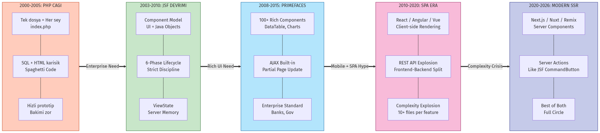

---

## 🎯 Üç Temel İlke: Değişmeyen Hakikatler

Bu yolculukta tekrar tekrar göreceğiniz üç evrensel hakikat var. Bunları baştan bilmek, teknolojiler arasındaki geçişleri anlamanızı kolaylaştıracak.

> [!NOTE]  
> **"Yeni teknolojiler, eski problemleri yeni söz dizimiyle (syntax) çözer. Problemler sabittir."**


  

> [!TIP] Alternatif Görsel Fikri: **"Buzdağı (Iceberg)"**  
> Üstte: Basit bir buton (Görünen).  
> Altta: Devasa dişliler, kablolar ve mekanizmalar (Görünmeyen Mühendislik).


### İlke 1: State Management Asla Kaybolmaz, Sadece Yer Değiştirir

**Durum yönetimi** web'in temel problemidir. HTTP protokolü "stateless" (durumsuz) olduğu için, kullanıcının durumunu bir yerde tutmalıyız:

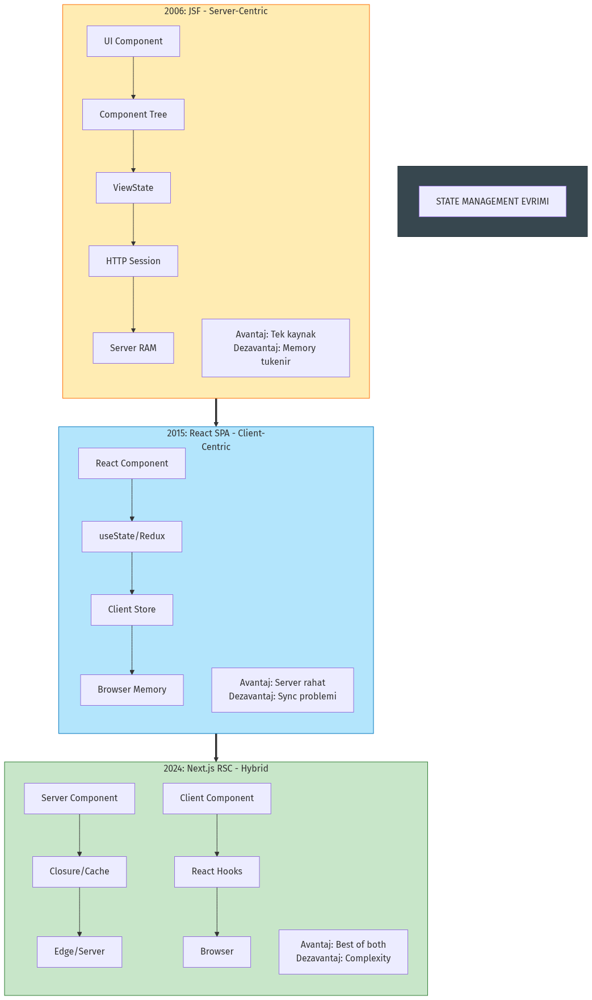

- **JSF (2006)**: Sunucu RAM'inde (Session + ViewState)
- **React SPA (2015)**: Tarayıcı hafızasında (Redux, Context)
- **Next.js (2024)**: Hibrit (Sunucu + Client, closure ile)

**Değişen:** Nerede saklandığı  
**Değişmeyen:** Saklanması gerektiği

#### State Saklama Yöntemlerinin Evrimi

Sunucunun kullanıcıyı "hatırlaması" için kullanılan yöntemler de evrim geçirdi:

| Dönem | Yöntem | Teknoloji | Artısı | Eksisi |
|-------|--------|-----------|--------|---------|
| **1990'lar** | Dosya (Disk) | Text Files | Basit | Çok yavaş, kilitlenme |
| **2000'ler** | RAM (In-Memory) | Servlet Session | Çok hızlı | Sunucu kapanırsa uçar |
| **2005-2015** | **Veritabanı** | SQL Session Table  | **Kalıcı, Web Farm** | **DB'yi yorar** |
| **2010+** | Cache Sunucusu | **Redis, Memcached** | Hızlı + Paylaşılır | Ekstra altyapı |
| **2015+** | Client-Side | JWT Token | Sunucu masrafsız | Logout yönetimi zor |

> [!NOTE]  
> **Bankacılık ve yüksek güvenlikli sistemler** bugün bile Redis ile birlikte veritabanını kullanır. "Kesinlikle kaybolmaması gereken" session verileri için performans kaybı göze alınır.

**Günümüzde (2024)**: Çoğu sistem **Redis** (hızlı cache) + **JWT** (stateless API) kombini kullanıyor.

### İlke 2: Abstraction Arttıkça Kontrol Azalır

**Abstraction** (soyutlama), kodun üstünü örtmektir. Ne kadar çok örtersen, o kadar az görürsün ve kontrol edersen.

- **Düşük Abstraction** (PHP): Her şeyi görürsün, her şeyi manuel yaparsın
- **Orta Abstraction** (JSF): Lifecycle gizli, ama yönetilebilir
- **Yüksek Abstraction** (Modern frameworks): "Magic" gibi çalışır, ama hata ayıklama zor

**Tradeoff:** Rahatlık vs Kontrol

### İlke 3: Complexity Yok Edilemez, Sadece Transfer Edilir

Fizikteki "Enerjinin Korunumu Yasası" gibi, yazılımda da "**Karmaşıklığın Korunumu**" vardır.


  

> [!TIP] Alternatif Görsel Fikri: **"Su Yatağı (Waterbed Theory)"**  
> Bir taraftan bastırınca (Sunucuyu basitleştir), diğer taraf şişer (Client karmaşıklaşır). Karmaşıklık hacmi asla azalmaz.


- **JSF**: Karmaşıklık sunucuda (Lifecycle, Session)
- **SPA**: Karmaşıklık istemcide (State sync, Tooling)  
- **Modern Stack**: Karmaşıklık dağıtıldı (Sunucu + İstemci + Build Time)

**Sonuç:** Karmaşıklığı yok edemezsiniz, sadece en az zarar vereceği yere taşırsınız.

---

## 1️⃣ Başlangıç: PHP Çağı (2000-2005)

### Bağlam: 2000'lerin Web'i
- İnternet hızları: 56k modem, ADSL yeni yeni
- E-ticaret patlaması (Amazon, eBay)
- Web uygulamaları çoğunlukla basit CRUD
- Güvenlik henüz birincil öncelik değil

### PHP'nin "Tek Dosya" Felsefesi

PHP, web geliştirmeyi demokratikleştirdi. Herhangi biri bir `.php` dosyası oluşturup FTP ile sunucuya atabilirdi.

**Örnek: Kullanıcı Listesi (users.php)**

```php
<?php
// Veritabanı bağlantısı
$conn = mysql_connect("localhost", "root", "password");
mysql_select_db("myapp", $conn);

// Veri çekme
$result = mysql_query("SELECT * FROM users");
?>

<!DOCTYPE html>
<html>
<head><title>Kullanıcılar</title></head>
<body>
    <h1>Kullanıcı Listesi</h1>
    <table border="1">
        <tr><th>ID</th><th>İsim</th><th>Email</th></tr>
        <?php while($row = mysql_fetch_assoc($result)): ?>
        <tr>
            <td><?= $row['id'] ?></td>
            <td><?= $row['name'] ?></td>
            <td><?= $row['email'] ?></td>
        </tr>
        <?php endwhile; ?>
    </table>
</body>
</html>
```

### ✅ PHP'nin Güçlü Yönleri

1. **Locality of Behavior**: Her şey bir yerde, anlaşılır
2. **Hızlı Geliştirme**: Fikir → Kod → Canlı: 10 dakika
3. **Düşük Öğrenme Eğrisi**: HTML biliyorsanız, PHP öğrenebilirsiniz
4. **Deployment Basitliği**: FTP yeterli

> [!NOTE] DevOps Perspektifi: "FTP ile At Çalışsın"
> O dönemde CI/CD yoktu. Canlıdaki dosyayı Notepad ile açıp editlemek "normal" sayılırdı. Rollback stratejisi: "Eski dosyanın yedeğini `index_bak.php` yapmaktı." Basit ama tehlikeli.

### ❌ PHP'nin Sınırları

1. **Güvenlik Açıkları**: SQL Injection (yukarıdaki kod savunmasız!)
2. **Bakım Sorunu**: 5000 satırlık `index.php` dosyaları
3. **Separation of Concerns Yok**: SQL, Business Logic, HTML hepsi bir arada
4. **Ölçekleme Zorluğu**: Session yönetimi, code reusability
5. **Tip Güvenliği Yok**: Runtime hatalar yaygın

### Neden Yeterli Değildi?

2005'e gelindiğinde, web uygulamaları karmaşıklaştı:
- Banka sistemleri
- Kurumsal ERP'ler
- Çok kullanıcılı sistemler
- Güvenlik kritik hale geldi

**Enterprise dünyası şunu sordu**: "PHP'nin basitliğini koruyabilir, ama Java'nın güvenliğini ve yapısını ekleyebilir miyiz?"

Cevap: **JSP ve JSF**

---

## 2️⃣ Büyük Resim: Mimari Sarkaç (The Pendulum)

Yazılım dünyası doğrusal bir çizgide ilerlemez; bir sarkaç gibi salınır. Biz şu an, sarkacın tekrar "Sunucu" (Server) tarafına döndüğü tarihi bir ana tanıklık ediyoruz.

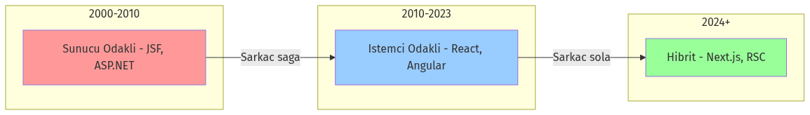

### Aydınlanma Anı (The Aha! Moment)
*   **Dün (JSF):** `h:commandButton` ile sunucudaki bir Java metodunu çağırırdık.
*   **Bugün (Next.js):** `Server Actions` ile sunucudaki bir TypeScript fonksiyonunu çağırıyoruz.
*   **Fark:** Aradaki teknoloji (XML vs JSX, HTTP Session vs Closure) değişti, ama **zihniyet** (Mindset) aynı: "Veri nerede duruyorsa, işlem orada yapılmalıdır."

### Component Ağacı: UI Nerede Yaşıyor?

UI bileşenlerimiz (Button, Input, Panel) nerede yaşıyor? Bu sorunun cevabı, mimarinin kalbidir.

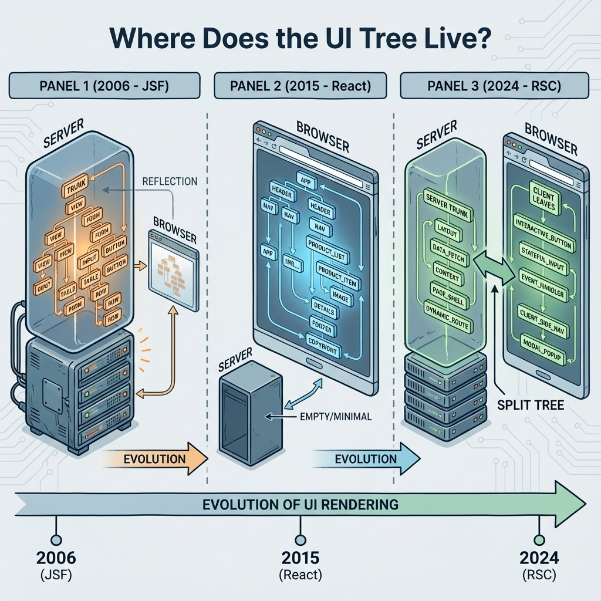

<!-- TODO: review -->

<!-- ⚠️ EKSİK GÖRSEL: Bu dosya henüz oluşturulmamış -->

<!-- 📸 GÖRSEL PROMPT: component_tree_evolution.png
Prompt: "Three-panel horizontal illustration showing component tree location over time:
PANEL 1 (2006 - JSF): Tree inside a SERVER box, browser shows only reflection
PANEL 2 (2015 - React): Tree inside BROWSER box, server is empty/minimal
PANEL 3 (2024 - RSC): Tree split - trunk/branches in SERVER, leaves in BROWSER
Arrows showing evolution. Timeline at bottom.
Title: 'Where Does the UI Tree Live?'"
Boyut: 1600x500px, Format: PNG -->

#### A. JSF: "Ağaç Sunucuda Yaşar"
JSF'de `UIViewRoot` sunucu hafızasındadır (Heap). Tarayıcı sadece bir "yansıtıcıdır" (Renderer).
*   **Avantaj:** Güvenli, veritabanına yakın.
*   **Dezavantaj:** Sunucu belleği şişer (Session Replication derdi).

#### B. React SPA: "Ağaç Tarayıcıya Taşındı"
2010'larda ağacı söküp kullanıcının tarayıcısına (Virtual DOM) taşıdık.
*   **Avantaj:** Sunucu rahatladı (Stateless), etkileşim hızlandı.
*   **Bedel:** Kullanıcının telefonu ısındı, "Loading..." spinner'ları hayatımıza girdi.

#### C. Modern Mimari (RSC): "Ağaç Eve Dönüyor"
React Server Components (RSC) ile ağacın gövdesini tekrar sunucuya taşıdık, sadece yapraklarını (Interactivity) tarayıcıda bıraktık.

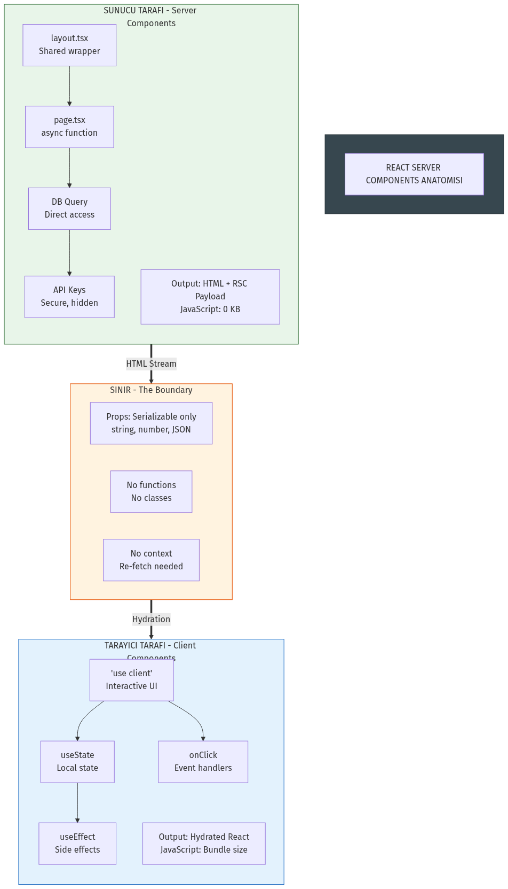

### 🔍 JSF'in Kalbi: Request Processing Lifecycle

> [!IMPORTANT]  
> **"Çoğu geliştirici JSF'i 'Sihirli bir kutu' olarak görür. Bir inputText koyarsınız, veritabanına gider. Arada ne olur? Bilinmez. Bugün o kutuyu açıyoruz. Göreceğimiz şey sihir değil; HTTP protokolünü Java nesnelerine, Java nesnelerini HTML'e çeviren devasa bir 'Çeviri Motoru'dur."**

#### 6 Fazlı Döngü: Her İstekte Aynı Hikaye

Bir JSF sayfasına tıkladığınızda, sunucu tarafında bu **6 adım asla şaşmaz**. Modern frontend framework'lerinde `useEffect` karmaşası yaşarken, JSF 20 yıldır bu katı disiplini uygular.

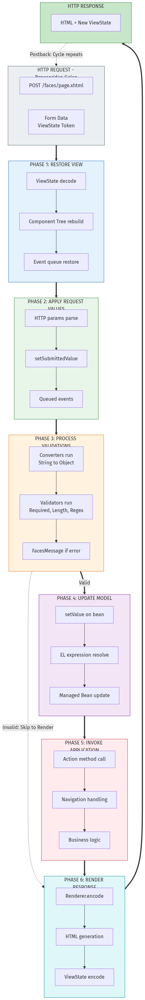


  

> [!TIP] Alternatif Görsel: **"Fabrika Montaj Hattı"**  
> Ham madde (Request) girer → 1. İstasyon (Restore) → 2. İstasyon (Apply) ... → Ürün (Response) çıkar. Hatalı ürün (Validation Error) hattan erken atılır.


#### Faz 1, 2, 3: Verinin Yolculuğu Başlıyor

**Senaryo**: Kullanıcı "Kullanıcı Adı"nı girdi ve "Giriş" butonuna bastı.

##### 1. Restore View (Hafızayı Çağır)

JSF bakar: *"Bu kullanıcı daha önce bu sayfada mıydı?"*
- **Evet ise**: Sunucu RAM'inden o sayfanın nesne ağacını (`UIViewRoot`) bulur
- **Hayır ise**: Yeni bir `UIViewRoot` oluşturur

**Analiz**: React'in "Re-hydration" (istemci tarafında canlandırma) işleminin sunucu tarafındaki atasıdır.

##### 2. Apply Request Values (Ham Veriyi Al)

HTTP POST isteğindeki `input_1=Ahmet` parametresini okur:
1. İlgili `UIInput` bileşenini bulur
2. Değerini set eder
3. **Henüz Java Bean'e dokunmaz!** Sadece UI bileşeni güncellenir

##### 3. Process Validations (Kapı Bekçisi)

Bileşende `required="true"` veya `<f:validateLength>` var mı?
- Kontrol edilir
- **Hata varsa**: Yaşam döngüsü burada kesilir ve **Faz 6'ya atlanır** (Hata mesajı göstermek için)
- **Başarılı ise**: Devam et

#### Faz 4 ve 5: Asıl İş Şimdi Yapılıyor

##### 4. Update Model Values (Java ile Buluşma)

Validasyon geçtiyse, UI bileşenindeki "Ahmet" değeri, arka plandaki **Java Sınıfına** (`UserBean.username`) yazılır.

**Kritik Nokta**: Tip dönüşümü (Converter) burada yapılır:
- String "10" → Integer 10

##### 5. Invoke Application (Aksiyon Zamanı)

Butona bağlı olan metodu (`#{userBean.login}`) çalıştırır:
- Veritabanı sorgusu
- İş mantığı
- Navigasyon (Sayfa yönlendirmesi)

**Kod Örneği (Backing Bean)**:
```java
// Sadece 5. Fazda (Invoke Application) buraya geliriz!
public String login() {
    User user = userService.find(this.username); // Business Logic
    if (user != null) return "dashboard?faces-redirect=true";
    return null; // Aynı sayfada kal
}
```

> [!NOTE]  
> **Dikkat ettiniz mi?** Sizin yazdığınız Java kodu (`login` metodu) ancak **5. aşamada** çalıştı. Önceki 4 aşamayı JSF sizin için halletti. Modern frameworklerde (React, Angular) ise validasyonu, veri binding'i, tip dönüşümünü **manuel olarak** kodlamak zorundasınız.

#### Gizli Kahraman: Component Tree (UIViewRoot)


  

> [!TIP] Alternatif Görsel: **"Ayna Yansıması"**  
> Sol tarafta HTML DOM (Tarayıcı). Sağ tarafta aynadaki yansıması: Java Nesne Ağacı (Sunucu). Birebir eşleşmeyi gösterir.


**HTML tarafı**:
```html
<input type="text" id="name">
<button id="submit">Gönder</button>
```

**Java tarafı (Sunucu RAM'i)**:
```java
UIViewRoot root = new UIViewRoot();
UIInput nameInput = new UIInput();
nameInput.setId("name");
root.getChildren().add(nameInput);

UICommand submitButton = new UICommand();
// ...
```

**Analiz: Stateful vs Stateless**

- JSF, sayfadaki **her bir etiketin Java nesnesi karşılığını** sunucu belleğinde (Session) tutar
- **ViewState**: Bu ağacın durumunu koruyan şifreli bir string'dir
- **Maliyet**: 1 Kullanıcı = 10KB RAM ise, 100.000 Kullanıcı = **1GB RAM** (Sadece arayüz durumu için!)

**Aha Moment!**  
React'te "Virtual DOM" diye bir şey duydunuz değil mi? Tarayıcı hafızasında DOM'un bir kopyasını tutar. İşte JSF bunu **2004 yılında** "Component Tree" adıyla yapıyordu, tek farkı bunu tarayıcıda değil **sunucuda** yapmasıydı. **Fikir aynı, yer farklı.**

#### PrimeFaces ve jQuery Gerçeği (The Wrapper)

> [!WARNING]  
> **Geliştirici sırrı açığa çıkıyor!** PrimeFaces bir büyü değildir. PrimeFaces, sunucu tarafında Java ile konfigüre edilmiş devasa bir **jQuery fabrikası**dır.

**Kod İncelemesi**:

**Siz yazarsınız (JSF/PrimeFaces)**:
```xml
<p:calendar value="#{bean.date}" />
```

**Tarayıcıda oluşan (Generated HTML & Script)**:
```html
<input id="frm:date" name="frm:date" type="text" />
<script>
    // JSF/PrimeFaces tarafından otomatik üretilen script
    $(function(){
        PrimeFaces.cw("Calendar", "widget_frm_date", {
            id: "frm:date",
            dateFormat: "dd.mm.yy",
            showButtonPanel: true,
            // ... 50+ satır jQuery konfigürasyonu
        });
    });
</script>
```


  

> [!TIP] Alternatif Görsel: **"Matruşka Bebek"**  
> En dışta: JSF Component.  
> İçinde: PrimeFaces Renderer.  
> En içte: jQuery Plugin.  
> Kullanıcı sadece en dışı görür.


**Konuşmacı Notu**:  
"Siz Java yazarsınız, o sizin yerinize jQuery scripti yazar ve sayfaya basar. Bugün jQuery kullanmak 'ayıp' sayılıyor ama PrimeFaces kullandığınızda aslında **en ağır şekilde jQuery kullanıyorsunuz**. Sadece elinizi kirletmiyorsunuz."

#### Renderer Mekanizması (Görünümden Bağımsızlık)

JSF'nin en az anlaşılan gücü: **"Write Once, Render Anywhere"**

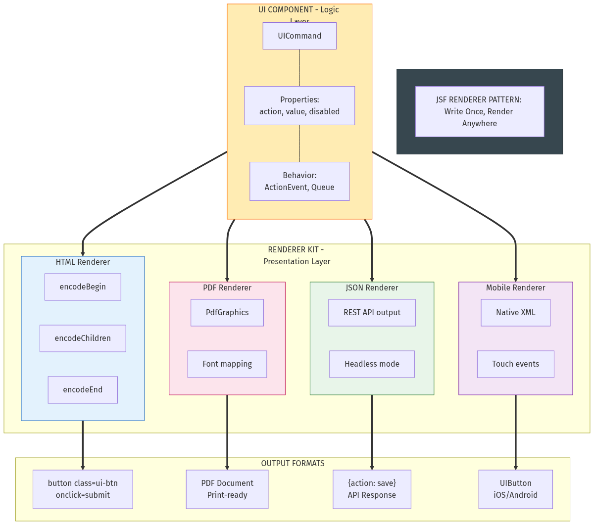

**Bileşen (Logic)** ile **Görüntü (Renderer)** ayrıdır:
- Teorik olarak, JSF kodunuzu hiç değiştirmeden, sadece "Renderer" değiştirerek çıktıyı:
  - HTML'den → Android XML'ine
  - PDF'e
  - JSON API'ye

çevirebilirsiniz.

**Bu mimari esneklik**, modern kütüphanelerin çoğunda (Tight Coupling yüzünden) yoktur.

#### JSF'in Bize Verdiği vs Bizden Aldığı

| JSF'in Bize Verdiği (Abstraction) | Bizden Aldığı Bedel (Cost) |
|-----------------------------------|----------------------------|
| HTML/JS yazmadan UI geliştirme | Sunucu CPU ve RAM kullanımı (Component Tree) |
| Otomatik Validasyon ve State Yönetimi | Esneklik kaybı (Lifecycle dışına çıkmak zordur) |
| Yüksek Güvenlik (Business Logic sunucuda) | Network trafiği (Her tıklamada sunucuya git-gel) |
| Tip Güvenliği (Java end-to-end) | Öğrenme eğrisi (Lifecycle, Scopes, Converters) |
| Component Reusability | Session Replication (Cluster ortamda zorluk) |

> [!NOTE] DevOps Perspektifi: "Uygulama Sunucusu Cehennemi"
> JSF döneminde DevOps'un kabusu **Stateful Scaling** idi. Sunucu RAM'inde session tutulduğu için, bir sunucu çökünce kullanıcı logout olurdu. Çözüm? **Sticky Session** veya karmaşık **Session Replication** ayarları (Multicast, JGroups). Deployment, 50MB'lık bir `.war` dosyasını WildFly'a atmaktan ibaretti ama o sunucuyu ayakta tutmak sanattı.

> [!NOTE]  
> **Kapanış**: JSF'in içini açtık. Gördük ki bu bir karmaşa değil, HTTP'nin eksiklerini kapatmak için tasarlanmış **çok katı kuralları olan bir devlet dairesi** gibi. İşler yavaş ama güvenli yürür, kurallar bellidir.

---

## 3️⃣ PrimeFaces Devrimi (2008-2015): JSF'in Altın Çağı

### Problem: JSF Çıplak ve Sade

Temel JSF component'leri fonksiyoneldi ama **estetikten uzaktı**:

```xml
<!-- Temel JSF DataTable - sade ve özelliksiz -->
<h:dataTable value="#{userBean.users}" var="user">
    <h:column>
        <f:facet name="header">İsim</f:facet>
        #{user.name}
    </h:column>
    <h:column>
        <f:facet name="header">Email</f:facet>
        #{user.email}
    </h:column>
</h:dataTable>
```

**Sorunlar:**
- Pagination yok (kendin yaz)
- Sorting yok
- Filtering yok
- AJAX yok
- Görsel olarak 1990'lar stili

### PrimeFaces'in Getirdiği Devrim

PrimeFaces, JSF'i **modern, zengin ve kullanılabilir** hale getirdi.

#### Aynı Tablo, PrimeFaces ile:

```xml
<p:dataTable value="#{userBean.users}" var="user" 
             paginator="true" rows="10"
             selectionMode="single" selection="#{userBean.selectedUser}"
             filterDelay="1000"
             styleClass="myTable">
    
    <!-- AJAX row selection -->
    <p:ajax event="rowSelect" 
            listener="#{userBean.onRowSelect}" 
            update=":form:userDetail" />
    
    <!-- Sortable ve filterable column -->
    <p:column headerText="İsim" 
              sortBy="#{user.name}" 
              filterBy="#{user.name}"
              filterMatchMode="contains">
        <h:outputText value="#{user.name}" />
    </p:column>
    
    <p:column headerText="Email" 
              sortBy="#{user.email}" 
              filterBy="#{user.email}">
        <h:outputText value="#{user.email}" />
    </p:column>
    
    <!-- Action buttons -->
    <p:column headerText="İşlemler">
        <p:commandButton icon="ui-icon-pencil" 
                         action="#{userBean.edit(user)}"
                         update=":form:editDialog" 
                         oncomplete="PF('editDialog').show()" />
        <p:commandButton icon="ui-icon-trash" 
                         action="#{userBean.delete(user)}"
                         update="@form">
            <p:confirm message="Silmek istediğinize emin misiniz?" />
        </p:commandButton>
    </p:column>
</p:dataTable>

<!-- Confirm Dialog -->
<p:confirmDialog global="true" showEffect="fade">
    <p:commandButton value="Evet" styleClass="ui-confirmdialog-yes" />
    <p:commandButton value="Hayır" styleClass="ui-confirmdialog-no" />
</p:confirmDialog>
```

**12 satırda:**
- ✅ Pagination
- ✅ Client-side filtering
- ✅ Server-side sorting
- ✅ Row selection (AJAX)
- ✅ Modal dialog integration
- ✅ Confirmation popups
- ✅ Themeable UI

### PrimeFaces AJAX: Partial Page Rendering

JSF'in en büyük eksiği buydu. PrimeFaces çözdü:

```xml
<h:form id="myForm">
    <p:inputText id="username" value="#{bean.username}" />
    
    <!-- AJAX blur event -->
    <p:ajax event="blur" 
            listener="#{bean.checkUsername}" 
            update="usernameMsg" />
    
    <h:outputText id="usernameMsg" 
                  value="#{bean.usernameMessage}" 
                  style="color: #{bean.usernameValid ? 'green' : 'red'}" />
</h:form>
```

**Kullanıcı input'tan çıktığında:**
1. AJAX request sunucuya gider
2. `checkUsername()` metodu çalışır
3. Sadece `usernameMsg` component'i güncellenir
4. **Sayfa yenilenmez!**

Bu, 2010'da **SPA benzeri bir deneyimdi**.

### PrimeFaces Showcase: Ne Mümkündü?

**Component'ler:**
- `p:dataTable`: Advanced grid
- `p:fileUpload`: Drag & drop file upload
- `p:chart`: Google Charts entegrasyonu
- `p:schedule`: Full calendar
- `p:tree`: Hierarchical tree view
- `p:dialog`: Modal dialogs
- `p:galleria`: Image gallery
- `p:carousel`: Carousel slider

> [!TIP]  
> **Karmaşık İç İçe UI'lar İçin**: Dialog içinde dialog, form içinde tablo, nested yapılar gerektiren enterprise uygulamalarda PrimeFaces çok güçlüdür. `p:dialog` modal state yönetimi otomatiktir. React'te her modal için visibility state, z-index yönetimi, escape handling manuel yapılmalıdır.

**Gerçek dünya örneği:**

```xml
<!-- Dosya yükleme + ilerleme çubuğu + AJAX -->
<p:fileUpload value="#{bean.file}" 
              mode="advanced" 
              dragDropSupport="true"
              update="messages" 
              sizeLimit="100000000" 
              fileLimit="3" 
              allowTypes="/(\.|\/)(gif|jpe?g|png)$/" />

<p:growl id="messages" showDetail="true" />
```

### PrimeFaces + JSF Ekosistemi: Enterprise Standart

**2010-2015 arası tipik stack:**
- **Frontend**: PrimeFaces + JSF
- **Backend**: EJB veya CDI Beans
- **ORM**: JPA (Hibernate)
- **Server**: WildFly, GlassFish, WebLogic
- **Database**: Oracle, PostgreSQL

**Tam stack örnek:**

```java
// Entity
@Entity
public class Product {
    @Id @GeneratedValue
    private Long id;
    private String name;
    private BigDecimal price;
    // getters/setters
}

// Repository (JPA)
@Stateless
public class ProductRepository {
    @PersistenceContext
    private EntityManager em;
    
    public List<Product> findAll() {
        return em.createQuery("SELECT p FROM Product p", Product.class)
                 .getResultList();
    }
}

// Managed Bean
@Named
@ViewScoped
public class ProductBean implements Serializable {
    @Inject
    private ProductRepository productRepo;
    
    private List<Product> products;
    private Product selectedProduct;
    
    @PostConstruct
    public void init() {
        products = productRepo.findAll();
    }
    
    public void onRowSelect(SelectEvent event) {
        FacesMessage msg = new FacesMessage("Ürün Seçildi", 
            ((Product) event.getObject()).getName());
        FacesContext.getCurrentInstance().addMessage(null, msg);
    }
}
```

```xml
<!-- View (products.xhtml) -->
<p:dataTable value="#{productBean.products}" var="product"
             selectionMode="single" 
             selection="#{productBean.selectedProduct}">
    <p:ajax event="rowSelect" listener="#{productBean.onRowSelect}" />
    
    <p:column headerText="Ürün">#{product.name}</p:column>
    <p:column headerText="Fiyat">#{product.price}</p:column>
</p:dataTable>
```

**3 dosya:**
1. `Product.java` (Entity)
2. `ProductBean.java` (Logic)
3. `products.xhtml` (View)

**Karşılaştırma**: Aynı işi modern React SPA ile yaparsanız → 12 dosya (göreceğiz!)

### ✅ Neden JSF + PrimeFaces Başarılıydı?

1. **Tam çözüm**: UI component'leri + backend + veritabanı tek stack
2. **Tip güvenliği**: Entity → Bean → View, hepsi Java
3. **AJAX deneyimi**: SPA benzeri UX, ama sunucu kontrolünde
4. **Enterprise desteği**: Oracle, Red Hat backing
5. **Büyük ekosistem**: OmniFaces, BootsFaces, vb.

### ❌ Ama Yetmedi. Neden?

2010'da dünya değişti. **iPhone**.

---

## 4️⃣ Büyük Kopuş: Mobil Çağ ve SPA (2010-2015)

### 2010'da Ne Değişti?

**Teknik gerçek:**
- iPhone 4 çıktı (2010)
- Android patlaması → 2014'te mobil trafik %50'yi geçti
- 3G → 4G geçişi

**Kullanıcı beklentisi:**
- "Uygulama gibi" deneyim
- Anında geri bildirim, smooth transitions
- Offline çalışma

### Ama Dur! PrimeFaces Zaten AJAX Yapıyordu?

**Doğru!** PrimeFaces `p:ajax` ile partial updates yapıyordu. **O halde neden terk edildi?**

#### Teknik Sebepler:

1. **Sınırlı AJAX**: Sadece belirli component'ler update edilebiliyordu
2. **Sunucu bağımlılığı**: Her tıklama sunucuya gidiyordu
3. **Routing yok**: URL değişimi = full page load
4. **Mobile-first değil**: Responsive ama native değil

#### Sosyal/Kültürel Sebepler (DAHA ÖNEMLİ!):

1. **"Java eski"** algısı (2010'larda güçlendi)
2. **JavaScript ekosistemi patlaması**: npm, Node.js
3. **Startup kültürü**: Hızlı prototip (JSF kurumsal/ağır)
4. **Açık kaynak momentum**: React, Angular GitHub'da patladı
5. **Mobil developer'lar**: JavaScript biliyorlar, Java değil

> [!IMPORTANT]  
> **Teknik üstünlük tek başına yeterli değildir.** PrimeFaces teknik olarak AJAX yapabiliyordu ama **algı değişmişti**. "Modern" olmak bir teknoloji sorunu değil, **kültürel momentum** sorunuydu.

### AngularJS ve React'in Vaatleri

**AngularJS (2010)**: Two-way data binding, SPA, tamamen JavaScript  
**React (2013)**: Virtual DOM, component-based, "UI = f(state)"

**REST API Ideology**: Frontend ve Backend tamamen bağımsız → Microservices uyumlu

---

## 5️⃣ SPA Dönemi: Karmaşıklık Patlaması (2015-2023)

### Spring Boot + React: Yeni Standart

2015-2020 arası tipik startup stack:
- **Frontend**: React + Redux + Axios
- **API**: Spring Boot + REST
- **Database**: PostgreSQL

### "12 Dosya Problemi": Aynı Özellik, Farklı Karmaşıklık

**Özellik**: Kullanıcı listesi göster, düzenle, kaydet.

**JSF + PrimeFaces (2010) - 3 Dosya:**
1. `User.java` (Entity)
2. `UserBean.java` (Logic)
3. `users.xhtml` (View)

**React SPA + Spring Boot (2018) - 12 Dosya:**

**Backend (7 dosya):**
1. `User.java` (Entity)
2. `UserDTO.java` ← Entity expose etmeyelim!
3. `UserMapper.java` ← DTO ↔ Entity
4. `UserRepository.java`
5. `UserService.java`
6. `UserController.java` ← REST
7. `SecurityConfig.java` ← CORS, JWT

**Frontend (5 dosya):**
8. `User.ts` ← TypeScript (DUPLICATE tanım!)
9. `userApi.ts` ← Axios
10. `userSlice.ts` ← Redux state
11. `UserForm.tsx`
12. `UserPage.tsx`


  

> [!TIP] Alternatif Görsel: **"Hazır Yemek vs Malzemeler"**  
> JSF (3 Dosya): Paketlenmiş, ısıt-ye hazır yemek (Hızlı ama içeriği değiştiremezsin).  
> React (12 Dosya): Un, yumurta, şeker, süt... (Tam kontrol ama birleştirmek senin işin).


### Accidental Complexity (Arızi Karmaşıklık)

**Essential Complexity**: İş mantığının doğal karmaşıklığı  
**Accidental Complexity**: Araçların getirdiği karmaşıklık

**SPA'da Accidental Complexity:**
1. **Tip senkronizasyonu**: `User.java` vs `UserDTO.java` vs `User.ts` (3 yerde aynı yapı!)
2. **Mapping katmanı**: Entity → DTO → JSON → TypeScript
3. **Ağ hatası yönetimi**: Her API için try-catch, retry, timeout
4. **State senkronizasyonu**: Server vs Client state
5. **Loading states**: Her API için `isLoading`, `error` state'leri

### Kod Karşılaştırması: User Kaydetme

**JSF + PrimeFaces (2010)**:
```xml
<h:form>
    <h:inputText value="#{userBean.username}" />
    <h:inputText value="#{userBean.email}" />
    <h:commandButton value="Kaydet" action="#{userBean.save}" />
</h:form>
```

```java
public void save() {
    User user = new User(this.username, this.email);
    userRepository.save(user);
}
```
**2 dosya. Tip güvenliği var. State senkronizasyonu yok.**

**React SPA - Sadece Frontend Kısmı** (Backend 7 dosya ekstra):
```typescript
// types/User.ts
export interface User {
    username: string;
    email: string;
}

// store/userSlice.ts (Redux - 40+ satır boilerplate)
export const createUser = createAsyncThunk('users/create', ...);

// components/UserForm.tsx
const [username, setUsername] = useState('');
const [email, setEmail] = useState('');
const dispatch = useDispatch();

const handleSubmit = async (e) => {
    e.preventDefault();
    await dispatch(createUser({ username, email }));
};
```
**Görsel 1: Sol tarafta JSF'in 3 satırlık `save` metodu, sağ tarafta React'in aynı işi yapan dağıtık yapısı (Slice, Component, API).**


### Diğer SPA Sorunları

1. **Bundle Size**: 1.2 MB JavaScript (ilk yüklemede)
2. **Waterfall Data Fetching**: Component açıldıkça API çağrıları
3. **SEO**: JavaScript yüklenmeden sayfa boş
4. **Offline Development**:  Backend API çalışmadan frontend test edilemez

> [!NOTE] DevOps Perspektifi: "Build Pipeline Patlaması"
> SPA ile birlikte DevOps'un işi **Runtime**'dan **Build Time**'a kaydı.
> *   **Eskiden:** `javac` -> `.war` (Bitti)
> *   **Şimdi:** `npm install` (500MB node_modules) -> `webpack build` -> `docker build` -> `k8s deploy`.
> *   **Sorunlar:** CORS ayarları, Nginx history-mode config, Environment variable yönetimi (.env vs Runtime env). Karmaşıklık koddan altyapıya kaydı.

### "Killer Feature" Karşılaştırması: DataTable

**Senaryo**: 10,000 kayıtlık kullanıcı listesi. Pagination, sorting, filtering.


**Görsel 2: PrimeFaces'in declarative (ne istediğini söyle) yapısı vs React Table'ın imperative (nasıl yapılacağını söyle) kurulumu.**

> [!NOTE]  
> **Veri odaklı işlerde JSF'in ROI (Yatırım Getirisi) rakipsizdir.** Bir kurumsal admin panelinde 50 tablo varsa, JSF ile 1 haftada yaparsınız. React ile her tablo için tekerleği yeniden icat edersiniz.

**"50 Tablo Gerç" - Neden?**

| Özellik | JSF (PrimeFaces) | React (MUI/AntD/TanStack) |
|---------|------------------|----------------------------|
| **Tablo Kurulumu** | 5 satır kod | 50+ satır kod (State + API) |
| **API İhtiyacı** | ❌ Yok (Doğrudan Bean'e bağlı) | ✅ Şart (REST/GraphQL) |
| **"Wiring" (Bağlama)** | ✅ Otomatik (Framework yapar) | ❌ Manuel (Her tablo için tekrar) |
| **50 Tablo Süresi** | **1 Hafta** | **3-4 Hafta** (Framework olmadan) |

**React'te sorun kütüphane eksikliği değil, "wiring" maliyetidir**: Her tabloda pagination, sorting, filtering API'ye bağlanmalı. JSF'de bu bağlantı otomatiktir.

### Declarative vs Imperative: AJAX Örneği

**Senaryo**: "Kaydet" butonuna basınca sadece mesaj güncellensin (sayfa yenilenmesin).


**Görsel 3: JSF'te AJAX sadece bir etikettir (`<f:ajax>`). React'te ise state yönetimi, hata yakalama ve loading durumlarını elle kodlamanız gerekir.Declarative vs Imperative**

**Fark**: JSF'te **NE** istediğimizi söylüyoruz (`render="mesajPaneli"`). React'te **NASIL** yapılacağını adım adım kodluyoruz. Karmaşık mantıkta declarative yaklaşım hatayı azaltır.

### Görünmeyen Kod: "Glue Code" Analizi


  

> [!TIP] Alternatif Görsel: **"Koli Bandı Mimarisi (Duct Tape Architecture)"**  
> Modern Stack: Harika görünen parçalar, ama hepsi birbirine koli bandıyla (Glue Code) tutturulmuş.  
> JSF: Tek parça döküm blok (Monolitik sağlamlık).


**JSF Projesi:**
- **Görünen Kod**: %80 İş Mantığı (Java), %20 UI (XHTML)
- **Saklanan Kod**: Network handling, DOM manipulation, State syncing → **Framework hallediyor**

**Modern Stack Projesi:**
- **Görünen Kod**: %40 İş Mantığı, %60 **Glue Code**
- **Glue Code Nedir?**: JSON parse, DTO mapping, HTTP status kontrolü, Loading spinner, Error boundary, Retry logic

> [!IMPORTANT]  
> 2024'ün geliştiricisi, mesaisinin büyük kısmını **"iş problemini çözmeye"** değil, **"teknolojileri birbirine bağlamaya"** harcıyor. JSON formatı uydu mu? State güncellendi mi? JSF bizi bu "hamallıktan" kurtarıyordu. Karşılığında özgürlüğümüzü alıyordu.

**Sonuç**: Separation of Concerns kazandırdı, ama karmaşıklık patladı.

---

## 6️⃣ Modern SSR: Eve Dönüş (2024+)

### 2020'lerde Neler Fark Edildi?

SPA'nın sorunları giderek belirginleşti:
- Bundle size şişti (3-5 MB normal!)
- SEO hala problem (Google bile indexlemeyi zor yapıyor)
- Waterfall data fetching (her component kendi API'sını çağırıyor)
- **Complexity overload**: 12 dosya sadece basit CRUD için

### Next.js ve Server Components Vizyonu

**React Server Components (RSC)** + **Server Actions** = JSF'e geri dönüş (ama modern tooling ile)

**JSF demiştik ki:**
- UI logic sunucuda (Managed Bean)
- Component ağacı sunucuda (UIViewRoot)
- Action methods sunucuda çalışır

**Next.js (2024) diyor ki:**
- UI logic sunucuda (Server Component)
- Component  tree sunucuda render  edilir
- Server Actions sunucuda çalışır


<!-- 📸 GÖRSEL PROMPT: pendulum_returns.png
Prompt: "A pendulum clock illustration with 3 marked positions:
LEFT (2006): 'Server-Centric' - JSF logo, Java coffee cup
CENTER (2015): 'Client-Centric' - React logo, JavaScript yellow
RIGHT (2024): 'Server-Centric (Again)' - Next.js logo, but HIGHER position
The pendulum trail shows an UPWARD SPIRAL, not just back-and-forth.
Arrow pointing up with text: 'Not returning, ASCENDING'
Style: Elegant, clock mechanism aesthetic."
Boyut: 1200x800px, Format: PNG -->  

### JSF ile Next.js Karşılaştırması

| Özellik | JSF (2006) | Next.js RSC (2024) |
|---------|------------|---------------------|
| **Render Yeri** | Sunucu (Java) | Sunucu (Node.js) |
| **Action Methods** | `#{bean.save()}` | `'use server'` functions |
| **State Taşıma** | ViewState (hidden input) | Closure (encrypted metadata) |
| **Tip Güvenliği** | Java end-to-end | TypeScript end-to-end |
| **Component Model** | JSF Component Tree | React Component Tree |
| **Data Fetching** | Direct DB (JPA) | Direct DB (Prisma, **supabase**) |

**En çarpıcı benzerlik**: Her ikisi de `"Veritabanı sunucuya yakın, UI logic da orda olsun"` diyor!

### Next.js Server Action Örneği

```typescript
// app/actions.ts
'use server' // JSF'in @Named gibi!

import { db } from '@/lib/db';

export async function saveUser(formData: FormData) {
    const username = formData.get('username') as string;
    
    // Direkt veritabanına yaz (JPA repository gibi!)
    await db.user.create({
        data: { username }
    });
    
    revalidatePath('/users'); // Sayfayı yenile
}
```

```tsx
// app/users/page.tsx (Server Component)
export default async function UsersPage() {
    // JSF'in @PostConstruct init() gibi!
    const users = await db.user.findMany();
    
    return <UserList users={users} />;
}
```

### Farklar: Neden "Eskiye Dönüş" Değil?

1. **TypeScript**: JSF (XML config + Java), Next.js (full type safety)
2. **Modern Tooling**: Hot reload, Vite, modern DX
3. **Edge Computing**: Sunucu coğrafi olarak dağıtılabiliyor
4. **Hibrit**: Client component'ler interactivity için (JSF bu esnekliği vermiyordu)
5. **Streaming**: HTML parça parça gönderilebiliyor (Suspense)

> [!NOTE]  
> **"Spiral yukarı çıkarak dönüyor"**: JSF'in felsefesi (server-centric) + Modern tooling + TypeScript + Edge = Next.js

---

## Kod Arkeolojisi: İsimler Değişir, Desenler Kalır

Gelin, 20 yıl arayla yazılmış iki kod parçasına bakalım. Benzerlik şok edicidir.

### Senaryo: Bir Kullanıcıyı Kaydetmek


**Görsel 4: Tarih tekerrür ediyor. 2006'daki Managed Bean metodu ile 2024'teki Server Action arasındaki şaşırtıcı benzerlik.**

**Yorum:** REST API yok. JSON parse etmek yok. `fetch()` yok. Sadece fonksiyon çağrısı var. **Tarih tekerrür etti.**

---

## 4. Gizli Kahraman: State Yönetimi (ViewState vs Closure)

JSF'in en çok eleştirilen yanı `ViewState` (o devasa şifreli hidden input) idi. Modern mimari bunu nasıl çözdü?

*   **JSF:** Sunucu durumunu (State) korumak için sayfaya gizli bir `input` gömerdi.
*   **Next.js:** Fonksiyonun bağlamını (Context) korumak için **Closure** kullanır ve bunu şifreleyip HTML'e gömer.

Aslında ikisi de aynı şeyi yapar: **Stateless olan HTTP protokolü üzerinde, Stateful bir deneyim simüle etmek.**

> **Ufuk Açıcı Not:** Modern mimari, "Stateless" dogmasından vazgeçip, "Akıllı State" (Smart State) kavramına geçiş yapmıştır. Artık her şeyi sunucuda tutmuyoruz (RAM tasarrufu), ama her şeyi istemciye de yüklemiyoruz (Network tasarrufu).

---

## 5. Karmaşıklık Eğrisi: Neden Dönüyoruz?

Neden SPA'dan SSR'a dönülüyor? Çünkü "Arızi Karmaşıklık" (Accidental Complexity) yönetilemez hale geldi.
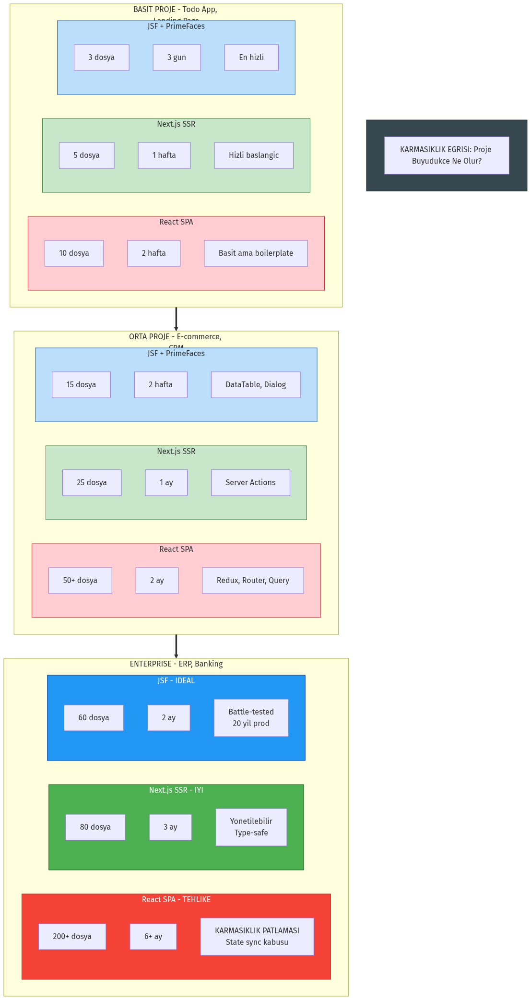

*   **SPA + REST:** Basit bir "Merhaba Dünya" için bile DTO, Controller, Service, Axios, Redux, Store, Component gerekir. (10+ Dosya)
*   **Modern Monolit:** Veritabanı ve UI yan yana. (2-3 Dosya). Tip güvenliği (Type Safety) uçtan uca otomatik.
## 7️⃣ Veri Perspektifi: Mimari Kararların Gerçek Maliyeti

Mimari seçimler sadece "hangi framework" sorusu değildir. **Verinin nereden geldiği, nasıl işlendiği ve nereye gittiği** en kritik karardır.

### Temel Soru: Veri Nerede İşleniyor?

| Mimari | Veri Akışı | Network Hop |
|--------|-----------|-------------|
| **Server-Centric (JSF)** | DB → Java → HTML | 1 (Tek round-trip) |
| **SPA + REST** | DB → Java → JSON → JS → DOM | 2+ (Çoklu round-trip) |
| **RSC (Next.js)** | DB → Node → HTML (+ JSON delta) | 1-2 (Hibrit) |

### N+1 Query Problemi: Lazy Loading'in Bedeli


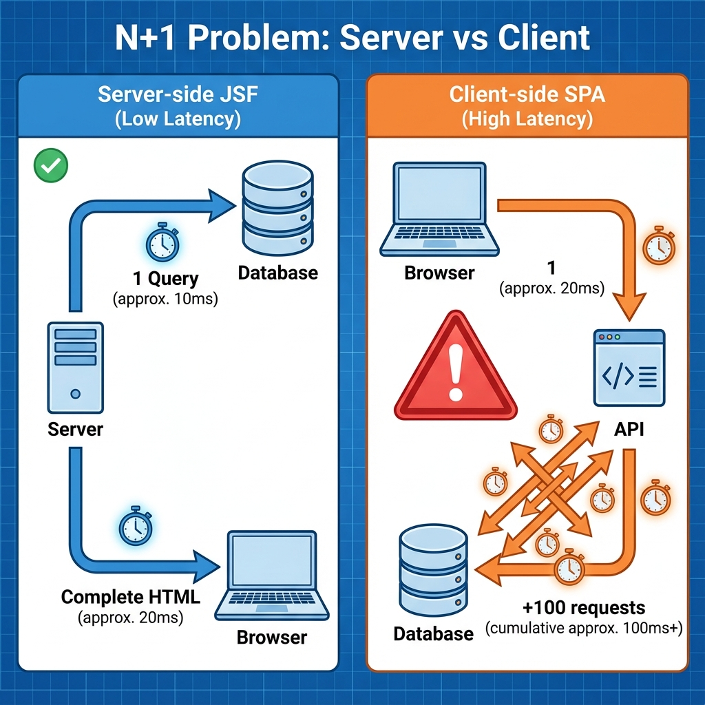

<!-- ⚠️ EKSİK GÖRSEL: Bu dosya henüz oluşturulmamış -->

<!-- 📸 GÖRSEL PROMPT: n_plus_one_problem.png
Prompt: "Split comparison diagram:
LEFT (Server-side JSF): Single arrow from 'Server' to 'Database' with '1 Query' label, 
then single arrow to 'Browser' with complete HTML
RIGHT (Client-side SPA): Arrow from 'Browser' to 'API' labeled '1', then 100 small arrows 
back and forth labeled '+100 requests'. Red warning icon.
Title: 'N+1 Problem: Server vs Client'
Style: Network diagram with latency indicators."
Boyut: 1400x600px, Format: PNG -->

**Senaryo**: 100 kullanıcı listesi, her birinin departmanı gösterilecek.

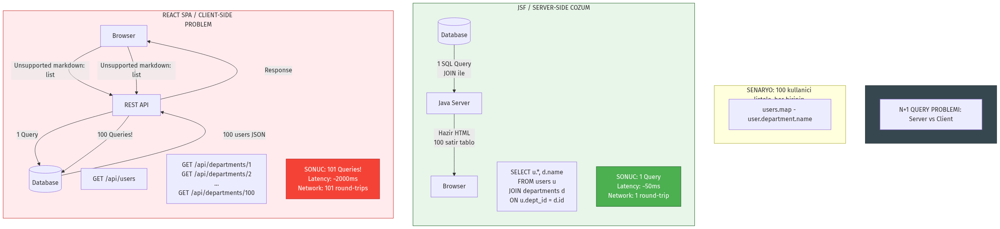

**JSF (Sunucu tarafı)**:
```java
// Tek sorgu ile JOIN - sunucuda çözülür
@NamedQuery("SELECT u FROM User u JOIN FETCH u.department")
public List<User> getUsers() {
    return em.createNamedQuery("...", User.class).getResultList();
}
```
→ **1 SQL sorgusu**, HTML client'a hazır gider

**React SPA (Client tarafı)**:
```typescript
// İlk istek: kullanıcılar
const users = await fetch('/api/users'); // 1 istek

// Her satır renderda: departman lazy load
{users.map(u => <DepartmentBadge deptId={u.deptId} />)} 
// Her DepartmentBadge kendi verisini çeker → +100 istek!
```
→ **101 HTTP isteği** (N+1 problem client'a taşındı)

> [!WARNING]  
> **Client tarafında Lazy Loading**, sunucu tarafındaki N+1 probleminin **daha kötü** bir versiyonudur. Çünkü her "lazy" çağrı bir **network round-trip**'tir.

### Over-fetching vs Under-fetching

| Problem | Açıklama | Sonuç |
|---------|----------|-------|
| **Over-fetching** | Gereğinden fazla veri çekilir | REST `/users` → 50 alan döner, 3'ü kullanılır |
| **Under-fetching** | Eksik veri, ek istek gerekir | `/users` sonrası `/users/1/orders` lazım |

**JSF avantajı**: Sunucu neyi render edeceğini bilir, sadece gerekeni çeker.  
**SPA dezavantajı**: API "ne lazım olur" bilmez, ya fazla ya eksik gönderir.

### Veri Yoğunluğu ve Mimari Seçimi

| | Düşük Etkileşim | Yüksek Etkileşim |
|---|---|---|
| **Çok Veri** | ✅ Server Components (Admin, Dashboard) | ⚠️ SPA + GraphQL (E-ticaret) |
| **Az Veri** | 🟢 Statik Site (Blog) | 🔵 SPA + REST (Chat, Real-time) |

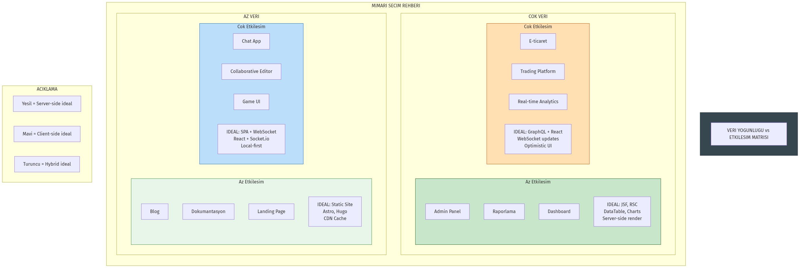

**Yorumlama:**
- **Sol üst (Çok veri, az etkileşim)**: JSF/PrimeFaces veya Server Components ideal
- **Sağ alt (Az veri, çok etkileşim)**: SPA ideal (Chat, real-time)
- **Ortada**: Hibrit yaklaşımlar (Next.js RSC)

### Payload Karşılaştırması: Aynı Sayfa, Farklı Mimariler

**Senaryo**: 100 satırlık kullanıcı tablosu

| Mimari | İlk Yükleme | Veri Transferi | Toplam | TTI* |
|--------|-------------|----------------|--------|------|
| **JSF + PrimeFaces** | 80 KB HTML | — | **80 KB** | ~200ms |
| **React SPA** | 350 KB JS | + 45 KB JSON | **395 KB** | ~800ms |
| **Next.js RSC** | 60 KB HTML + 20 KB JS | — | **80 KB** | ~250ms |

*TTI: Time to Interactive

### Waterfall: Client'ta mı, Server'da mı?

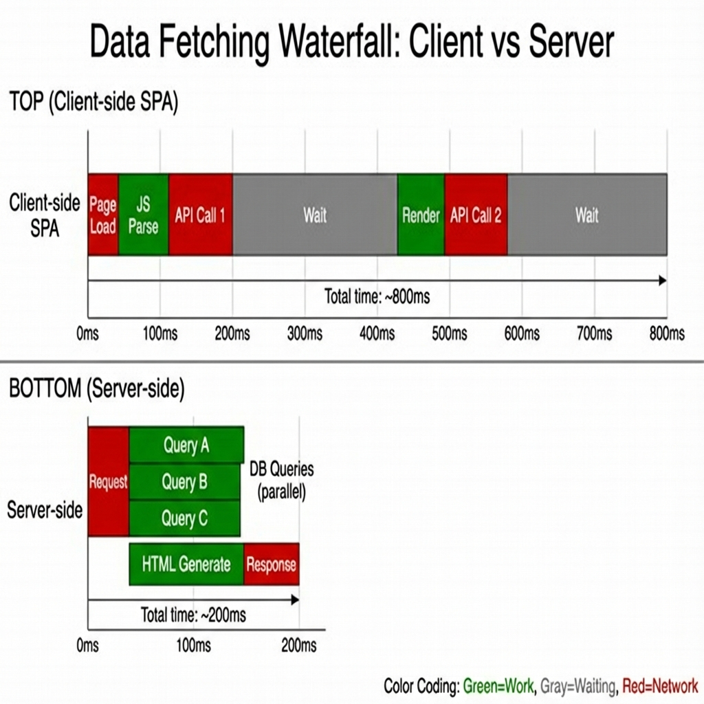


<!-- ⚠️ EKSİK GÖRSEL: Bu dosya henüz oluşturulmamış -->

<!-- 📸 GÖRSEL PROMPT: waterfall_comparison.png
Prompt: "Two waterfall/timeline diagrams stacked vertically:
TOP (Client-side SPA): Long sequential bars showing:
  'Page Load' -> 'JS Parse' -> 'API Call 1' -> 'Wait' -> 'Render' -> 'API Call 2' -> 'Wait'
  Total time: ~800ms, lots of gray 'waiting' segments
BOTTOM (Server-side): Compact parallel bars:
  'Request' -> 'DB Queries (parallel)' -> 'HTML Generate' -> 'Response'
  Total time: ~200ms, minimal waiting
Color coding: Green=work, Gray=waiting, Red=network
Title: 'Data Fetching Waterfall: Client vs Server'"
Boyut: 1200x800px, Format: PNG -->

**Client-side Data Fetching (SPA)**:
```
Sayfa yükle → JS parse → Veri iste → Bekle → Render → Alt veri iste → Bekle
[========]   [=====]    [=======]   [===]   [====]   [==========]   [===]
                         ↑ Network      ↑ Render      ↑ N+1 başlıyor
```
→ **Waterfall**: Kullanıcı uzun süre "Loading..." görür

**Server-side Data Fetching (JSF/RSC)**:
```
İstek → Sunucu: Tüm veriyi çek + HTML üret → Tek response
[===]   [===================================]   [========]
         ↑ DB sorguları paralel                  ↑ Hazır HTML
```
→ **Tek round-trip**: Kullanıcı direkt içerik görür

### Kritik İçgörü: Data Proximity


<!-- ⚠️ EKSİK GÖRSEL: Bu dosya henüz oluşturulmamış -->

<!-- 📸 GÖRSEL PROMPT: data_proximity_diagram.png
Prompt: "Concentric circles diagram showing data proximity:
CENTER: Database icon (smallest latency zone, green, '~1ms')
RING 1: 'Same JVM (JSF)' - green zone
RING 2: 'Same Server/Region (RSC)' - yellow zone, '~10ms'
RING 3: 'Same Data Center' - orange zone, '~50ms'  
RING 4: 'Cross Internet (SPA)' - red zone, '~200ms+'
Arrows showing request paths for each architecture.
Title: 'Data Proximity: Distance = Complexity'"
Boyut: 1000x1000px, Format: PNG -->

> **"Veri sunucuya ne kadar yakınsa, mimari o kadar basit."**

| Mimari | Veri Mesafesi | Tipik Latency |
|--------|---------------|---------------|
| JSF | DB ile aynı JVM | ~1-5ms |
| Next.js RSC | DB ile aynı sunucu/region | ~5-20ms |
| SPA + REST | Client → API → DB → API → Client | ~100-500ms |

**Sonuç**: Veri yoğun uygulamalarda (admin panel, dashboard, raporlama) **sunucu tarafı render** hem daha hızlı hem daha basittir.

---

## 8️⃣ JSF'ten Öğrenmemiz Gerekenler: Kayıp Best Practice'ler
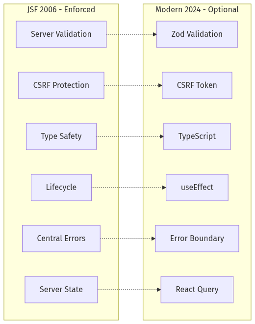


<!-- ⚠️ EKSİK GÖRSEL: Bu dosya henüz oluşturulmamış -->

<!-- 📸 GÖRSEL PROMPT: best_practices_comparison.png
Prompt: "A checklist comparison infographic with two columns:
LEFT COLUMN 'JSF (2006)': All items have GREEN checkmarks, locked padlock icons
- Server-side Validation ✓ (locked)
- CSRF Protection ✓ (locked)
- Type Safety ✓ (locked)
- Lifecycle Discipline ✓ (locked)
- Centralized Errors ✓ (locked)
- Server State ✓ (locked)

RIGHT COLUMN 'Modern Stack (2024)': Items have YELLOW warning icons, unlocked padlocks
- Server-side Validation ⚠ (optional)
- CSRF Protection ⚠ (often skipped)
- Type Safety ⚠ (manual setup)
- Lifecycle Discipline ⚠ (useEffect chaos)
- Centralized Errors ⚠ (scattered)
- Server State ⚠ (localStorage risk)

Title: 'JSF: Enforced by Framework | Modern: Your Responsibility'
Style: Clean checklist, corporate training material."
Boyut: 1200x800px, Format: PNG -->

JSF'te **framework zorunlu kılıyordu**, modern stack'te **"best practice" diyoruz ama çoğu projede atlanıyor**. Bu bölüm, JSF'in bize öğrettiği disiplinleri ve modern stack'te nasıl uygulanması gerektiğini anlatacağız.

### Temel Tez

> **JSF'te "yanlış yapamazdınız" çünkü framework izin vermezdi. Modern stack'te "doğru yapmak" sizin sorumluluğunuzdadır.**

### 1. Server-Side Validation: Güvenliğin Temeli

**JSF Yaklaşımı (Zorunlu)**:
```xml
<h:inputText value="#{bean.email}" required="true">
    <f:validateRegex pattern="^[a-zA-Z0-9+_.-]+@[a-zA-Z0-9.-]+$" />
</h:inputText>
```
- Validasyon **her zaman sunucuda** çalışır
- Client bypass edilemez
- Hata mesajları merkezi (`<h:messages />`)

**Modern Stack'te Sık Yapılan Hata**:
```typescript
// ❌ YANLIŞ: Sadece client-side validation
const handleSubmit = () => {
    if (!email.includes('@')) { // Tarayıcıda kolayca bypass edilir!
        setError('Geçersiz email');
        return;
    }
    api.post('/users', { email });
};
```

**Modern Stack'te Doğru Yaklaşım**:
```typescript
// ✅ DOĞRU: Server-side validation (Zod + Server Action)
// app/actions.ts
'use server'
import { z } from 'zod';

const UserSchema = z.object({
    email: z.string().email('Geçersiz email formatı'),
});

export async function createUser(formData: FormData) {
    const result = UserSchema.safeParse({
        email: formData.get('email'),
    });
    
    if (!result.success) {
        return { error: result.error.flatten() }; // Sunucu doğrulaması!
    }
    
    await db.user.create({ data: result.data });
}
```

> [!WARNING]  
> **Client-side validation UX içindir, güvenlik için değil.** JSF bunu biliyordu. Her validation sunucuda tekrarlanmalıdır.

---

### 2. CSRF Koruması: Sessiz Bekçi

**JSF Yaklaşımı (Otomatik)**:
```xml
<!-- JSF otomatik olarak her form'a ViewState token ekler -->
<h:form>
    <!-- Arka planda: <input type="hidden" name="javax.faces.ViewState" value="encrypted_token" /> -->
</h:form>
```
- Her POST isteği ViewState ile doğrulanır
- Token olmadan işlem yapılamaz
- **Sıfır konfigürasyon**

**Modern Stack'te Sık Atlanan**:
```typescript
// ❌ Birçok SPA projesi CSRF koruması olmadan çalışıyor
fetch('/api/transfer', {
    method: 'POST',
    body: JSON.stringify({ to: 'attacker', amount: 10000 })
});
```

**Modern Stack'te Doğru Yaklaşım**:
```typescript
// ✅ Next.js Server Actions otomatik CSRF koruması sağlar
// Veya manuel: Double Submit Cookie pattern

// middleware.ts
import { csrf } from '@/lib/csrf';

export async function POST(request: Request) {
    const token = request.headers.get('X-CSRF-Token');
    if (!csrf.verify(token)) {
        return Response.json({ error: 'Invalid CSRF' }, { status: 403 });
    }
    // ... işlem
}
```

**Checklist**:
- [ ] Her mutasyon (POST/PUT/DELETE) CSRF token gerektiriyor mu?
- [ ] Token HttpOnly cookie'de mi saklanıyor?
- [ ] SameSite=Strict kullanılıyor mu?

---

### 3. Tip Güvenliği: Uçtan Uca Bütünlük

**JSF Yaklaşımı (Java End-to-End)**:
```java
// Entity
public class User {
    private String email; // Tip: String
}

// Bean
public class UserBean {
    private User user; // Aynı tip
}

// View: #{userBean.user.email} → Derleme zamanı kontrolü
```
- Entity → Bean → View: **Tek tip tanımı**
- Refactoring güvenli (IDE tüm kullanımları bulur)
- Runtime tip hataları **imkansız**

**Modern Stack'te Sık Yapılan Hata**:
```typescript
// Backend (Java/Node)
class User { String email; }

// API Response (JSON) - Tip bilgisi kaybolur
{ "email": "test@test.com" }

// Frontend (TypeScript) - YENİDEN tanımla!
interface User { email: string; }

// ❌ 3 FARKLI YERDE AYNI TİP! Senkronizasyon hatası kaçınılmaz.
```

**Modern Stack'te Doğru Yaklaşım**:

**Seçenek A: Shared Types (Monorepo)**
```typescript
// packages/shared/types.ts
export interface User {
    email: string;
}

// Backend ve Frontend aynı tipi import eder
import { User } from '@shared/types';
```

**Seçenek B: Code Generation (OpenAPI/GraphQL)**
```bash
# OpenAPI spec'ten TypeScript tipleri üret
npx openapi-typescript ./api-spec.yaml -o ./types/api.ts
```

**Seçenek C: tRPC (End-to-End Type Safety)**
```typescript
// Server
export const userRouter = router({
    create: procedure
        .input(z.object({ email: z.string().email() }))
        .mutation(({ input }) => db.user.create({ data: input })),
});

// Client - Otomatik tip çıkarımı!
const result = await trpc.user.create.mutate({ email: 'test@test.com' });
```

> [!IMPORTANT]  
> **JSF'te tip uyumsuzluğu derleme hatasıydı. Modern stack'te runtime hatasıdır.** tRPC veya code generation kullanarak bu boşluğu kapatın.

---

### 4. Lifecycle Disiplini: Öngörülebilir Davranış

**JSF Yaklaşımı (6 Faz Garantisi)**:
```
Restore View → Apply Request → Validate → Update Model → Invoke Action → Render
```
- Her istek **aynı sırayla** işlenir
- Validasyon **her zaman** model güncellenmeden önce çalışır
- Side effect'ler sadece **Invoke Application** fazında

**Modern Stack'te Kaos**:
```typescript
// ❌ useEffect karmaşası - Sıra garantisi yok
useEffect(() => { fetchUser(); }, []);
useEffect(() => { validateForm(); }, [formData]);
useEffect(() => { if (isValid) saveUser(); }, [isValid]);
// Hangi sırayla çalışır? Race condition?
```

**Modern Stack'te Doğru Yaklaşım**:
```typescript
// ✅ Explicit lifecycle with state machine (XState veya manuel)
type State = 'idle' | 'validating' | 'submitting' | 'success' | 'error';

const [state, setState] = useState<State>('idle');

const handleSubmit = async () => {
    setState('validating');
    const validation = await validate(formData);
    
    if (!validation.success) {
        setState('error');
        return;
    }
    
    setState('submitting');
    await saveUser(formData);
    setState('success');
};
```

**Veya React 19 + Server Actions**:
```typescript
// ✅ useActionState - JSF benzeri form lifecycle
const [state, formAction, isPending] = useActionState(createUser, initialState);

return (
    <form action={formAction}>
        {state.error && <ErrorMessage error={state.error} />}
        <input name="email" />
        <button disabled={isPending}>
            {isPending ? 'Kaydediliyor...' : 'Kaydet'}
        </button>
    </form>
);
```

---

### 5. Merkezi Hata Yönetimi

**JSF Yaklaşımı (Tek Nokta)**:
```xml
<h:messages globalOnly="true" styleClass="error-messages" />
<!-- Tüm hatalar tek yerde toplanır -->
```

**Modern Stack'te Dağınık Hatalar**:
```typescript
// ❌ Her component kendi hatasını yönetir
const [error1, setError1] = useState(null);
const [error2, setError2] = useState(null);
// 50 component = 50 error state = bakım kabusu
```

**Modern Stack'te Doğru Yaklaşım**:
```typescript
// ✅ Error Boundary + Toast System
// app/layout.tsx
export default function Layout({ children }) {
    return (
        <ErrorBoundary fallback={<ErrorPage />}>
            <ToastProvider>
                {children}
            </ToastProvider>
        </ErrorBoundary>
    );
}

// Herhangi bir component'ten:
const { toast } = useToast();
try {
    await saveUser(data);
    toast.success('Kaydedildi');
} catch (e) {
    toast.error(e.message); // Merkezi bildirim
}
```

---

### 6. Session ve State Tutarlılığı

**JSF Yaklaşımı (Sunucu Otoritesi)**:
```java
@SessionScoped
public class CartBean {
    private List<Item> items; // Sunucu = Tek gerçek kaynak (Single Source of Truth)
}
```
- Sepet durumu **sadece sunucuda**
- Tarayıcı sekmesi, mobil uygulama → Hepsi aynı durumu görür
- Manipülasyon **imkansız**

**Modern Stack'te Tutarsızlık**:
```typescript
// ❌ Client state = Güvenilmez
localStorage.setItem('cart', JSON.stringify(items));
// Kullanıcı DevTools'tan fiyatları değiştirebilir!
```

**Modern Stack'te Doğru Yaklaşım**:
```typescript
// ✅ Server as Source of Truth
// Sepet sunucuda, client sadece görüntüler
const { data: cart } = useQuery(['cart'], fetchCart);

// Ekleme işlemi sunucuya gider
const addToCart = useMutation({
    mutationFn: (item) => api.post('/cart/add', item),
    onSuccess: () => queryClient.invalidateQueries(['cart']),
});
```

---

### Aksiyon Listesi: Projenizi Denetleyin

Mevcut SPA/SSR projenizde şu soruları sorun:

1. **Validation**: Tüm form validasyonları sunucuda tekrarlanıyor mu?
2. **CSRF**: Mutasyon endpoint'leri token doğrulaması yapıyor mu?
3. **Types**: Backend-Frontend tip senkronizasyonu otomatik mi?
4. **Lifecycle**: Form submission state'leri explicit mi (loading, error, success)?
5. **Errors**: Hata mesajları merkezi bir sistemden mi geliyor?
6. **State**: Kritik veriler (sepet, kullanıcı) sunucuda mı tutuluyor?

> [!NOTE]  
> **JSF bu soruların hepsine "evet" demek zorundaydı.** Modern stack'te "evet" demek sizin tercihinizdir. Tercih etmezseniz, güvenlik ve tutarlılık riske girer.

---

## 9️⃣ Hangi Mimariyi Seçmeli? (Karar Çerçevesi)

**Soruyu doğru sormalıyız**: "Hangi teknoloji daha iyi?" değil, **"Hangi mimari bu projenin ihtiyaçlarına uygun?"**

### Karar Ağacı (Decision Tree)

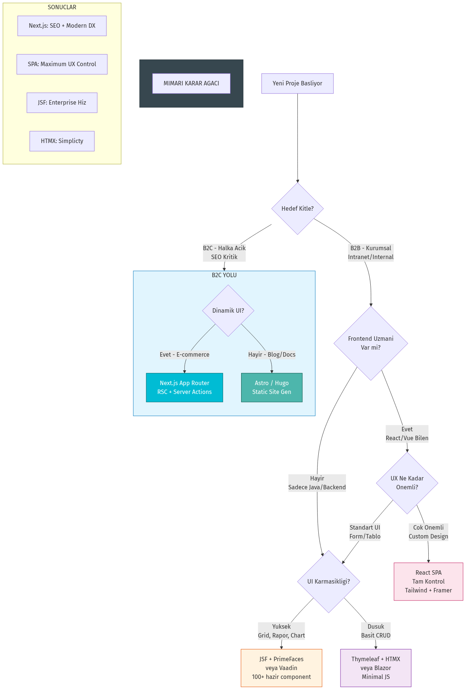

### Mimari Seçim Kriterleri

| Kriter | Server-Centric (JSF) | Client-Centric (SPA) | Hybrid (SSR) |
|--------|----------------------|----------------------|--------------|
| **SEO Önemli mi?** | ✅ Mükemmel | ❌ Zor | ✅ Mükemmel |
| **Veri Yoğun UI** | ✅ İdeal | ❌ Yorucu | ⚠️ Orta |
| **Real-time Updates** | ❌ Zayıf | ✅ İdeal | ✅ İyi |
| **Geliştirme Hızı (CRUD)** | ✅ Çok Hızlı | ❌ Yavaş | ⚠️ Orta |
| **Özelleştirme** | ❌ Zor | ✅ Tam Kontrol | ✅ İyi |
| **Java Team** | ✅ İdeal | ❌ Öğrenme eğrisi | ⚠️ Orta |

### Pratik Öneriler

**JSF (PrimeFaces) seçin eğer:**
- Çoğunlukla veri girişi, tablolar, formlar varsa
- Ekip Java biliyorsa, JavaScript bilmiyorsa
- Hız kritik (6 ayda 50 ekran yapılacak)
- İç kullanıcılar için (B2B/Internal)

**Modern SPA seçin eğer:**
- SEO kritikse (B2C, marketing)
- Çok dinamik, interaktif UI gerekiyorsa
- Ekip frontend uzmanıysa
- Mobil first tasarım şartsa

**Hybrid (Next.js SSR) seçin eğer:**
- İkisinin avantajlarını istiyorsanız
- SEO + Dinamik UI gerekiyorsa
- Type safety uçtan uca istiyorsanız

> [!IMPORTANT]  
> **Mimari kararı teknoloji değil, bağlamdır.** "Modern" olmak için React seçmek, 3x daha yavaş geliştirmeyi kabullenmek demektir. "Eski" kaldı diye JSF'i terk etmek, kanıtlanmış çözümden vazgeçmektir.

## 🏁 Kapanış

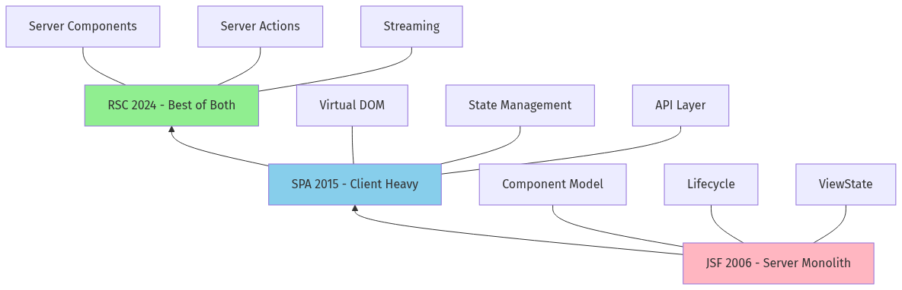


<!-- ⚠️ EKSİK GÖRSEL: Bu dosya henüz oluşturulmamış -->

<!-- 📸 GÖRSEL PROMPT: spiral_ascent_final.png
Prompt: "A dramatic upward spiral staircase illustration:
- Bottom level (dark, old): 'JSF 2006' with Java logo
- Middle level (bright, chaotic): 'SPA 2015' with React/Angular logos, scattered files
- Top level (bright, organized): 'RSC 2024' with Next.js logo, clean architecture
The spiral clearly goes UP, not just around. Light coming from above.
Text overlay: 'We're not going back. We're going UP.'
Style: Architectural visualization, inspirational."
Boyut: 1200x1000px, Format: PNG -->

**Son Söz:**
JSF öğrenmiş bir mühendis, Next.js öğrenirken zorlanmaz. Çünkü o, **dağıtık sistemlerin zorluklarını ve sunucu tarafı render etmenin konforunu** zaten biliyordur. 

> **"Teknolojiler değişir, mimari prensipler baki kalır."**