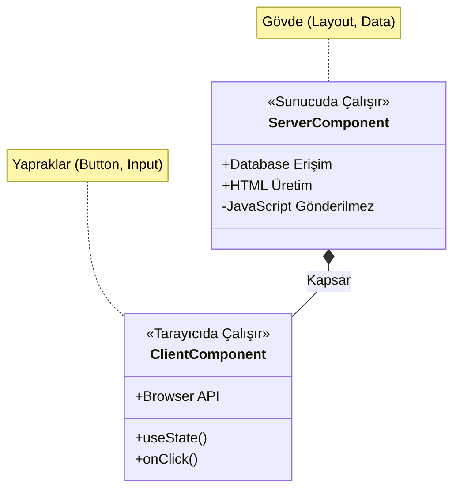

# JSF'ten Modern Mimariye: Tarihsel Döngü ve Pratik Dönüşüm Rehberi

**Ana Tema:** "Tarih Tekerrürden İbarettir: Sunucudan Ayrılış ve Eve Dönüş"

Bu doküman, 2000'lerin başındaki JSF (JavaServer Faces) mimarisi ile 2026'nın Modern Web Mimarisi (Next.js, RSC) arasındaki şaşırtıcı benzerlikleri, nedenlerini ve bu dönüşümün nasıl yönetileceğini anlatır. Amacımız bir teknolojiyi diğerine üstün kılmak değil, **mimari sarkacın** hareketini anlayarak geleceği öngörmektir.

---

## 1. Büyük Resim: Mimari Sarkaç (The Pendulum)

Yazılım dünyası doğrusal bir çizgide ilerlemez; bir sarkaç gibi salınır. Biz şu an, sarkacın tekrar "Sunucu" (Server) tarafına döndüğü tarihi bir ana tanıklık ediyoruz.

```mermaid
graph LR
    A[2000-2010: Sunucu Odaklı] -- Sarkaç İstemciye Kaydı --> B[2010-2023: İstemci Odaklı]
    B -- Sarkaç Sunucuya Döndü --> C[2024+: Hibrit/Sunucu Odaklı]
    
    subgraph "Dönem 1: Monolitik Güç"
    A --> JSF[JSF / ASP.NET]
    A --> Logic1[Mantık Sunucuda]
    end
    
    subgraph "Dönem 2: Dağıtık Özgürlük"
    B --> SPA[React / Angular SPA]
    B --> Logic2[Mantık Tarayıcıda]
    end
    
    subgraph "Dönem 3: Modern Sentez"
    C --> Next[Next.js / RSC]
    C --> Logic3[Mantık Sunucuda (Tekrar)]
    end
```

### Aydınlanma Anı (The Aha! Moment)
*   **Dün (JSF):** `h:commandButton` ile sunucudaki bir Java metodunu çağırırdık.
*   **Bugün (Next.js):** `Server Actions` ile sunucudaki bir TypeScript fonksiyonunu çağırıyoruz.
*   **Fark:** Aradaki teknoloji (XML vs JSX, HTTP Session vs Closure) değişti, ama **zihniyet** (Mindset) aynı: "Veri nerede duruyorsa, işlem orada yapılmalıdır."

---

## 2. Component Ağacı: Evden Uzakta Bir Gezi

UI bileşenlerimiz (Button, Input, Panel) nerede yaşıyor? Bu sorunun cevabı, mimarinin kalbidir.

### A. JSF: "Ağaç Sunucuda Yaşar"
JSF'de `UIViewRoot` sunucu hafızasındadır (Heap). Tarayıcı sadece bir "yansıtıcıdır" (Renderer).
*   **Avantaj:** Güvenli, veritabanına yakın.
*   **Dezavantaj:** Sunucu belleği şişer (Session Replication derdi).

### B. React SPA: "Ağaç Tarayıcıya Taşındı"
2010'larda ağacı söküp kullanıcının tarayıcısına (Virtual DOM) taşıdık.
*   **Avantaj:** Sunucu rahatladı (Stateless), etkileşim hızlandı.
*   **Bedel:** Kullanıcının telefonu ısındı, "Loading..." spinner'ları hayatımıza girdi.

### C. Modern Mimari (RSC): "Ağaç Eve Dönüyor"
React Server Components (RSC) ile ağacın gövdesini tekrar sunucuya taşıdık, sadece yapraklarını (Interactivity) tarayıcıda bıraktık.



---

## 3. Kod Arkeolojisi: İsimler Değişir, Desenler Kalır

Gelin, 20 yıl arayla yazılmış iki kod parçasına bakalım. Benzerlik şok edicidir.

### Senaryo: Bir Kullanıcıyı Kaydetmek

#### 2006: JSF (Managed Bean)
```java
// UserBean.java
public void saveUser() {
    // 1. Sunucu hafızasındaki veriyi al
    User user = new User(this.username);
    // 2. Veritabanına yaz
    userDao.save(user);
    // 3. Mesaj ver
    FacesContext.getCurrentInstance().addMessage(null, "Kaydedildi!");
}
```
*Tetikleyici:* `<h:commandButton action="#{userBean.saveUser}" />`

#### 2026: Next.js (Server Action)
```typescript
// actions.ts
'use server' // Bu bir "Managed Bean" metodudur!
export async function saveUser(formData: FormData) {
    // 1. Form verisini al
    const username = formData.get('username');
    // 2. Veritabanına yaz
    await db.user.create({ data: { username } });
    // 3. Mesaj dön
    return { message: "Kaydedildi!" };
}
```
*Tetikleyici:* `<form action={saveUser} />`

**Yorum:** REST API yok. JSON parse etmek yok. `fetch()` yok. Sadece fonksiyon çağrısı var. **Tarih tekerrür etti.**

---

## 4. Gizli Kahraman: State Yönetimi (ViewState vs Closure)

JSF'in en çok eleştirilen yanı `ViewState` (o devasa şifreli hidden input) idi. Modern mimari bunu nasıl çözdü?

*   **JSF:** Sunucu durumunu (State) korumak için sayfaya gizli bir `input` gömerdi.
*   **Next.js:** Fonksiyonun bağlamını (Context) korumak için **Closure** kullanır ve bunu şifreleyip HTML'e gömer.

Aslında ikisi de aynı şeyi yapar: **Stateless olan HTTP protokolü üzerinde, Stateful bir deneyim simüle etmek.**

> **Ufuk Açıcı Not:** Modern mimari, "Stateless" dogmasından vazgeçip, "Akıllı State" (Smart State) kavramına geçiş yapmıştır. Artık her şeyi sunucuda tutmuyoruz (RAM tasarrufu), ama her şeyi istemciye de yüklemiyoruz (Network tasarrufu).

---

## 5. Karmaşıklık Eğrisi: Neden Dönüyoruz?

Neden SPA (Single Page App) devri kapanıyor? Çünkü "Arızi Karmaşıklık" (Accidental Complexity) yönetilemez hale geldi.

```mermaid
xychart-beta
    title "Proje Büyüklüğüne Göre Karmaşıklık"
    x-axis [Basit App, Orta Ölçek, Enterprise]
    y-axis "Efor / Kod Satırı" 0 --> 100
    line [10, 40, 90] line-legend "React SPA + REST API"
    line [20, 30, 40] line-legend "Next.js / Modern Monolit"
```

*   **SPA + REST:** Basit bir "Merhaba Dünya" için bile DTO, Controller, Service, Axios, Redux, Store, Component gerekir. (10+ Dosya)
*   **Modern Monolit:** Veritabanı ve UI yan yana. (2-3 Dosya). Tip güvenliği (Type Safety) uçtan uca otomatik.

---

## 6. Dönüşüm Rehberi: Strangler Fig (Boğucu İncir)

Elinizde devasa bir JSF uygulaması var. "Hepsini silip baştan yazalım" derseniz, %90 ihtimalle başarısız olursunuz. Doğru strateji doğadan gelir: **Boğucu İncir Ağacı.**

1.  **Tohumu Ekin:** Mevcut JSF uygulamasının önüne modern bir "Proxy" (Next.js) koyun.
2.  **Dalları Sarın:** Yeni özellikleri (örn. `/dashboard`) Next.js ile yazın.
3.  **Gövdeyi Çürütün:** Eski sayfaları (örn. `/login`) teker teker Next.js'e taşıyın.
4.  **Sonuç:** Bir gün uyanacaksınız ve JSF tamamen yok olmuş, yerini modern yapı almış.

```mermaid
graph TD
    User[Kullanıcı] --> Proxy[Next.js (Proxy)]
    Proxy -->|Yeni Rotalar| Modern[Next.js App Router]
    Proxy -->|Eski Rotalar| Legacy[Eski JSF App]
    Modern --> DB[(Veritabanı)]
    Legacy --> DB
```

---

## 7. Gelecek Vizyonu (2030): Agentic Mesh

Sarkaç durmayacak. Şu an sunucuya döndük, peki sonra?

*   **WebAssembly (WASM):** Tarayıcılar o kadar güçlenecek ki, sunucu kodlarını (Node.js, Python, hatta Java) tarayıcının içinde, kum havuzunda (sandbox) çalıştıracağız.
*   **Agentic Mesh:** Uygulamalar "sayfalar" değil, birbirleriyle konuşan "ajanlar" olacak. UI, bu ajanların sohbetinin görselleşmiş hali olacak.

**Son Söz:**
JSF öğrenmiş bir mühendis, Next.js öğrenirken zorlanmaz. Çünkü o, **dağıtık sistemlerin zorluklarını ve sunucu tarafı render etmenin konforunu** zaten biliyordur. Teknolojiler değişir, mimari prensipler baki kalır.
